# PERANCANGAN DAN IMPLEMENTASI

## 3.1. Gambaran Umum Aplikasi

Reluv adalah platform e-commerce pasar barang bekas (preloved) yang dirancang sebagai marketplace C2C (Consumer-to-Consumer) terpusat di Indonesia. Aplikasi ini bertujuan untuk menyediakan ekosistem digital yang modern, tepercaya, dan efisien bagi komunitas penjual dan pembeli barang preloved. 

Dengan mengimplementasikan teknologi Server-Side Rendering (SSR) melalui framework Next.js dan NestJS, platform ini menawarkan performa tinggi, visibilitas SEO yang optimal, serta keamanan transaksi yang terintegrasi dengan payment gateway Midtrans dan sistem logistik Biteship.

## 3.2. Tahap Analisis

Tahap ini melibatkan identifikasi masalah yang ada di pasar preloved saat ini serta menentukan kebutuhan perangkat keras dan perangkat lunak untuk membangun solusi.

### 3.2.1. Analisis Masalah

Berdasarkan pengamatan, pasar preloved saat ini masih didominasi oleh metode penjualan yang terfragmentasi melalui media sosial, yang seringkali tidak efisien dan kurang aman. Masalah utama meliputi:

- Sulitnya pembeli dalam memvalidasi keaslian dan kondisi barang.
- Kurangnya sistem pembayaran yang aman dan otomatis (seringkali manual transfer).
- Sulitnya pelacakan pengiriman barang yang terstandarisasi.
- Rendahnya visibilitas produk di mesin pencari.

### 3.2.2. Analisis Kebutuhan Software dan Hardware

Untuk menunjang pembangunan aplikasi Reluv, dibutuhkan spesifikasi sebagai berikut:

#### 1. Perangkat Keras (Hardware)

- **Processor**: Intel® Core™ i7-12650H 2.3GHz (atau setara).
- **RAM**: 16 GB.
- **Storage**: SSD minimal 256 GB.

#### 2. Perangkat Lunak (Software)

- **Editor**: Visual Studio Code sebagai editor kode program utama.
- **Runtime Environment**: Node.js (v20+) untuk menjalankan Next.js dan NestJS.
- **Database Management**: Prisma Studio untuk mengelola database PostgreSQL.
- **Testing Tool**: Postman untuk pengujian API dan Google Chrome untuk pengujian antarmuka.
- **Operating System**: Windows 11 Home.

#### 3. Stack Teknologi

- **Backend Framework**: NestJS (TypeScript) untuk logika bisnis dan RESTful API.
- **Frontend Framework**: Next.js (TypeScript, Tailwind CSS) untuk antarmuka pengguna yang responsif.
- **Database & ORM**: PostgreSQL dengan Prisma ORM untuk manajemen data relasional.

#### 4. Vendor API

- **Logistic API**: Biteship untuk integrasi kurir dan pelacakan.
- **Payment Gateway**: Midtrans untuk sistem pembayaran otomatis.
- **Cloud Storage**: Cloudinary untuk penyimpanan aset gambar produk secara online.

## 3.3. Perancangan Website

Pada tahap ini dilakukan perancangan alur aplikasi, visualisasi sistem, dan struktur database.

### 3.3.1. Struktur Navigasi

Struktur navigasi yang digunakan adalah **Struktur Navigasi Composite (Campuran)**, yang memberikan fleksibilitas bagi pengguna untuk berpindah antar halaman secara bebas namun tetap teratur secara hirarkis.

#### 3.3.1.1. Struktur Navigasi Role Superadmin

Struktur navigasi pada role Superadmin menunjukkan pemetaan halaman yang dapat diakses oleh superadmin untuk mengelola seluruh platform Reluv. Setelah melakukan login dengan kredensial administratif, superadmin akan dialihkan ke halaman Dashboard yang menampilkan chart statistik pendapatan platform dan rekapan penjualan bulanan dalam bentuk visualisasi data menggunakan library Recharts. Dari halaman Dashboard, superadmin dapat mengakses halaman Products yang berfungsi untuk mengelola seluruh katalog produk di platform, termasuk menambahkan produk baru, mengedit informasi produk yang sudah ada, menghapus produk yang tidak sesuai, serta mempublikasikan atau menonaktifkan produk dari semua toko yang terdaftar. Selain itu, terdapat halaman Orders yang berfungsi untuk memonitoring seluruh riwayat transaksi yang terjadi di platform, melihat detail setiap pesanan, melakukan input nomor resi pengiriman jika diperlukan, serta mengupdate status transaksi. Halaman Manage User memungkinkan superadmin untuk mengatur seluruh akun pengguna yang terdaftar di platform, termasuk melihat daftar pengguna, mengedit informasi pengguna, mengaktifkan atau menonaktifkan akun pengguna untuk menjaga keamanan komunitas, serta menghapus akun yang melanggar ketentuan. Terakhir, terdapat halaman Profile yang berguna untuk memperbarui detail informasi akun superadmin yang sedang digunakan. Gambar struktur navigasi Superadmin dapat dilihat pada Gambar 3.1.

**Gambar 3.1 Struktur Navigasi Superadmin**


#### 3.3.1.2. Struktur Navigasi Role Store (Penjual)

Struktur navigasi pada role Store (Penjual) memiliki pemetaan yang berbeda dari struktur navigasi Superadmin, karena fokus pada pengelolaan toko dan produk milik penjual sendiri. Setelah melakukan login dengan kredensial penjual, penjual akan dialihkan ke halaman Dashboard Store yang menampilkan statistik penjualan toko, pendapatan yang diperoleh, produk terlaris, serta grafik penjualan bulanan untuk membantu penjual menganalisis performa tokonya. Dari halaman Dashboard, penjual dapat mengakses halaman Products yang berfungsi untuk mengelola produk-produk di tokonya sendiri, termasuk menambahkan produk baru dengan form upload gambar ke Cloudinary, mengedit informasi produk yang sudah ada, menghapus produk, serta mengelola varian produk seperti ukuran, warna, dan kondisi barang. Halaman Orders memungkinkan penjual untuk memonitoring pesanan yang masuk ke tokonya, memproses pesanan yang telah dibayar, melakukan input nomor resi pengiriman setelah barang dikirim, serta mengupdate status pengiriman. Halaman Reviews berfungsi untuk melihat review yang diberikan pembeli terhadap produk-produk di toko, serta memberikan balasan atau respons terhadap review tersebut untuk meningkatkan interaksi dengan pembeli. Halaman Vouchers memungkinkan penjual untuk membuat voucher diskon toko, mengedit voucher yang sudah ada, serta menghapus voucher yang sudah tidak berlaku, yang dapat digunakan pembeli saat melakukan checkout. Terakhir, halaman Settings berguna untuk mengelola profil toko, mengubah informasi kontak, mengatur alamat toko, serta melakukan pengaturan lainnya terkait konfigurasi toko. Gambar struktur navigasi Store (Penjual) dapat dilihat pada Gambar 3.2.

**Gambar 3.2 Struktur Navigasi Store (Penjual)**


#### 3.3.1.3. Struktur Navigasi Role User (Pembeli)

Struktur navigasi pada role User (Pembeli) dirancang untuk memberikan pengalaman belanja yang mudah dan intuitif. Setelah login atau sebagai pengunjung, pembeli akan diarahkan ke halaman Homepage yang menampilkan katalog produk preloved, banner promo, dan fitur pencarian untuk menemukan produk yang diinginkan. Pembeli dapat melakukan browsing produk berdasarkan kategori melalui halaman Kategori yang menyediakan filter berdasarkan kategori utama seperti Women (Wanita), Men (Pria), dan Kids (Anak-anak). Setelah menemukan produk yang menarik, pembeli dapat mengakses halaman Product Detail yang menampilkan informasi lengkap produk termasuk multiple images, deskripsi produk, varian produk (ukuran, warna, kondisi), review dari pembeli lain, serta informasi toko penjual. Dari halaman Product Detail, pembeli dapat menambahkan produk ke Cart (keranjang) atau ke Wishlist (daftar keinginan) untuk dibeli nanti. Halaman Cart berfungsi sebagai penampungan produk sementara sebelum melakukan checkout, dimana pembeli dapat mengubah jumlah item, menghapus item, atau melanjutkan ke proses checkout. Setelah pembeli sudah memilih produk yang ingin dibeli dan melanjutkan ke halaman Checkout, pembeli wajib untuk mengisi atau memilih alamat pengiriman, memilih jasa kurir yang tersedia melalui integrasi Biteship, memilih metode pembayaran, serta menggunakan voucher atau diskon jika tersedia. Setelah mengisi formulir dengan benar, pembeli dapat melakukan pembayaran melalui payment gateway Midtrans dengan nominal yang sesuai dengan total yang tertera. Setelah melakukan transaksi, pembeli dapat memeriksa status pembelian pada halaman Orders, dimana terdapat beberapa status yang tersedia yaitu PENDING (menunggu pembayaran), PAID (sudah dibayar), SHIPPED (sedang dikirim), DELIVERED (sudah diterima), dan COMPLETED (selesai), dengan fitur pelacakan pengiriman real-time melalui integrasi Biteship. Halaman Wishlist menampilkan semua produk yang telah disimpan pembeli untuk dibeli nanti, dimana pembeli dapat menghapus item dari wishlist atau menambahkan item ke keranjang. Halaman Profile memungkinkan pembeli untuk memperbarui informasi data diri, mengelola alamat pengiriman, melihat riwayat transaksi, serta mengakses fitur-fitur lainnya terkait akun. Terakhir, halaman Sell memungkinkan pembeli untuk memulai proses menjual produk dengan membuat toko baru atau mengakses dashboard toko jika sudah memiliki toko. Gambar struktur navigasi User (Pembeli) dapat dilihat pada Gambar 3.3.

**Gambar 3.3 Struktur Navigasi User (Pembeli)**


### 3.3.2. UML (Unified Modelling Language)

Perancangan sistem divisualisasikan menggunakan diagram UML (Unified Modelling Language) untuk mempermudah pemahaman aliran data, fungsi, dan interaksi antar komponen dalam sistem Reluv. Diagram UML yang digunakan meliputi Use Case Diagram untuk menggambarkan interaksi aktor dengan sistem, Activity Diagram untuk menjelaskan alur aktivitas proses bisnis, dan Class Diagram untuk memvisualisasikan struktur kelas dan hubungan antar entitas dalam database.

#### 3.3.2.1. Use Case Diagram

Use Case Diagram berfungsi untuk memahami sistem pada aplikasi website Reluv yang dibuat dan mengetahui siapa saja yang dapat menggunakan sistem-sistem tersebut. Pada Use Case Diagram sistem Reluv memiliki tiga aktor utama, yaitu Superadmin, Store (Penjual), dan User (Pembeli), serta dua aktor eksternal yaitu Payment Gateway Midtrans dan Shipping API Biteship.

Pada aktor Superadmin, interaksi yang dapat dilakukan adalah mengelola kategori produk untuk mengorganisir katalog produk di platform, mengelola user untuk mengatur seluruh akun pengguna yang terdaftar termasuk mengaktifkan, menonaktifkan, atau menghapus akun, serta memonitor transaksi untuk melihat seluruh riwayat transaksi yang terjadi di platform. Semua interaksi Superadmin memerlukan validasi kredensial melalui proses login.

Pada aktor Store (Penjual), interaksi yang dapat dilakukan adalah login untuk mengakses dashboard toko, mengelola produk dengan fitur menambah, mengubah, dan menghapus produk milik tokonya sendiri, dimana proses upload produk memerlukan upload gambar ke Cloudinary. Selain itu, penjual dapat mengelola toko untuk mengatur profil toko, informasi kontak, dan pengaturan lainnya, serta memonitor transaksi untuk melihat pesanan yang masuk ke tokonya dan melakukan input nomor resi pengiriman.

Pada aktor User (Pembeli), interaksi yang dapat dilakukan adalah registrasi untuk membuat akun baru dengan verifikasi email, login untuk mengakses sistem, mengelola profil untuk memperbarui informasi data diri dan alamat pengiriman, browse produk untuk melihat katalog produk, melakukan pencarian produk berdasarkan kata kunci, menambahkan produk ke keranjang, melakukan checkout yang memerlukan validasi kredensial dan dapat menggunakan voucher jika tersedia, melakukan pembayaran melalui integrasi dengan Payment Gateway Midtrans, melakukan tracking pesanan melalui integrasi dengan Shipping API Biteship, memberikan review produk setelah melakukan pembelian, serta membuat toko untuk memulai proses menjual produk.

Rancangan Use Case Diagram sistem Reluv dapat dilihat pada Gambar 3.4.

**Gambar 3.4 Use Case Diagram Sistem Reluv**

```mermaid
graph TB
    subgraph Actors[" "]
        direction TB
        User((👤 User<br/>Pembeli))
        Store((🏪 Store<br/>Penjual))
        Superadmin((👤 Superadmin))
        Payment((💳 Payment Gateway<br/>Midtrans))
        Shipping((🚚 Shipping API<br/>Biteship))
    end
    
    subgraph System["Sistem Reluv"]
        direction TB
        UC1((Registrasi))
        UC2((Login))
        UC3((Kelola Profil))
        UC4((Browse Produk))
        UC5((Pencarian Produk))
        UC6((Tambah ke Keranjang))
        UC7((Checkout))
        UC8((Pembayaran))
        UC9((Tracking Pesanan))
        UC10((Review Produk))
        UC11((Kelola Produk))
        UC12((Kelola Toko))
        UC13((Kelola Kategori))
        UC14((Kelola User))
        UC15((Monitor Transaksi))
        UC16((Validasi Kredensial))
        UC17((Gunakan Voucher))
        UC18((Upload Gambar))
        UC19((Buat Toko))
    end
    
    User ---|melakukan| UC1
    User ---|melakukan| UC2
    User ---|melakukan| UC3
    User ---|melakukan| UC4
    User ---|melakukan| UC5
    User ---|melakukan| UC6
    User ---|melakukan| UC7
    User ---|melakukan| UC8
    User ---|melakukan| UC9
    User ---|melakukan| UC10
    User ---|melakukan| UC19
    
    Store ---|melakukan| UC2
    Store ---|melakukan| UC11
    Store ---|melakukan| UC12
    Store ---|melakukan| UC15
    
    Superadmin ---|melakukan| UC2
    Superadmin ---|melakukan| UC13
    Superadmin ---|melakukan| UC14
    Superadmin ---|melakukan| UC15
    
    UC2 -.->|<<include>>| UC16
    UC7 -.->|<<include>>| UC6
    UC7 -.->|<<include>>| UC16
    UC7 -.->|<<extend>>| UC17
    UC11 -.->|<<include>>| UC18
    UC12 -.->|<<include>>| UC18
    
    UC8 ---|integrasi| Payment
    UC9 ---|integrasi| Shipping
    
    style User fill:#ffffff,stroke:#333,stroke-width:2px
    style Store fill:#ffffff,stroke:#333,stroke-width:2px
    style Superadmin fill:#ffffff,stroke:#333,stroke-width:2px
    style Payment fill:#ffffff,stroke:#333,stroke-width:2px
    style Shipping fill:#ffffff,stroke:#333,stroke-width:2px
```



#### 3.3.2.2. Activity Diagram

Activity Diagram menjelaskan aliran aktivitas mendetail dari proses transaksi dalam sistem Reluv, mulai dari proses pendaftaran akun hingga transaksi selesai. Alur dimulai dengan pengecekan status login pengguna, jika pengguna belum login maka akan diarahkan ke proses registrasi akun yang dilanjutkan dengan verifikasi email, setelah verifikasi email selesai pengguna dapat melakukan login. Setelah login, pengguna dapat melakukan browsing produk dan pencarian produk untuk menemukan produk yang diinginkan, kemudian memilih produk dan melihat detail produk. Dari halaman detail produk, pengguna dapat memutuskan untuk menambahkan produk ke keranjang atau kembali melakukan browsing.

Setelah produk ditambahkan ke keranjang, pengguna dapat melanjutkan ke proses checkout. Pada proses checkout, sistem akan mengecek apakah pengguna sudah memiliki alamat pengiriman, jika belum maka pengguna harus menambahkan alamat terlebih dahulu. Setelah alamat tersedia, pengguna dapat memilih kurir yang tersedia melalui integrasi Biteship. Setelah kurir dipilih, sistem akan memproses pembayaran melalui Payment Gateway Midtrans. Jika pembayaran berhasil, sistem akan membuat order baru dan secara bersamaan (fork) mengirim notifikasi ke penjual dan mengupdate stok produk. Setelah kedua proses tersebut selesai (join), penjual akan memproses order dan melakukan pengiriman barang.

Setelah barang dikirim, sistem akan melakukan tracking pengiriman secara real-time melalui integrasi Biteship. Ketika barang sudah diterima oleh pembeli, sistem akan secara bersamaan (fork) memungkinkan pembeli untuk memberikan review produk dan mengupdate status order menjadi completed. Setelah kedua proses tersebut selesai (join), proses transaksi dinyatakan selesai. Rancangan Activity Diagram proses transaksi sistem Reluv dapat dilihat pada Gambar 3.5.

**Gambar 3.5 Activity Diagram Proses Transaksi Sistem Reluv**


#### 3.3.2.3. Class Diagram

Class Diagram menggambarkan struktur kelas dan hubungan antar tabel dalam database PostgreSQL yang digunakan dalam sistem Reluv. Diagram ini mencakup entitas utama yaitu User yang memiliki relasi one-to-one dengan UserProfile untuk menyimpan informasi profil pengguna, relasi one-to-zero atau one dengan Store untuk menunjukkan bahwa pengguna dapat memiliki toko, relasi one-to-many dengan Order untuk menunjukkan bahwa satu pengguna dapat melakukan banyak transaksi, relasi one-to-one dengan Cart untuk menyimpan keranjang belanja pengguna, relasi one-to-many dengan Review untuk menunjukkan bahwa pengguna dapat memberikan banyak review, serta relasi one-to-many dengan Location untuk menyimpan beberapa alamat pengiriman.

Entitas Store memiliki relasi one-to-many dengan Product untuk menunjukkan bahwa satu toko dapat memiliki banyak produk. Entitas Product memiliki relasi one-to-many dengan Variant untuk menunjukkan bahwa satu produk dapat memiliki banyak varian (ukuran, warna, kondisi), relasi many-to-one dengan Category untuk menunjukkan bahwa produk dikategorikan, serta relasi one-to-many dengan Review untuk menunjukkan bahwa produk dapat menerima banyak review dari pembeli.

Entitas Order memiliki relasi one-to-many dengan OrderItem untuk menunjukkan bahwa satu order dapat berisi banyak item, relasi one-to-one dengan Payment untuk menyimpan informasi pembayaran, relasi one-to-one dengan Shipment untuk menyimpan informasi pengiriman, relasi many-to-one dengan User sebagai pembeli, serta relasi many-to-one dengan Location sebagai alamat pengiriman. Entitas OrderItem memiliki relasi many-to-one dengan Variant untuk menunjukkan item yang dibeli.

Entitas Cart memiliki relasi one-to-many dengan CartItem untuk menunjukkan bahwa keranjang dapat berisi banyak item, dan CartItem memiliki relasi many-to-one dengan Variant. Entitas Category memiliki relasi self-referencing one-to-many untuk mendukung struktur kategori bertingkat (parent-child). Rancangan Class Diagram sistem Reluv dapat dilihat pada Gambar 3.6.

**Gambar 3.6 Class Diagram Sistem Reluv**

```mermaid
classDiagram
    class User {
        +Int id
        +String email
        +String password
        +UserRole role
        +Boolean isVerified
        +Boolean isActive
        +DateTime createdAt
        +DateTime updatedAt
    }
    
    class UserProfile {
        +Int id
        +String avatar
        +String bio
        +Int userId
        +Gender gender
    }
    
    class Store {
        +Int id
        +String name
        +String slug
        +Boolean isVerified
        +Int totalProducts
        +Int totalSales
        +Float rating
        +Int userId
    }
    
    class Product {
        +Int id
        +String name
        +String slug
        +String description
        +String[] images
        +Boolean isPublished
        +Int sellerId
        +Int categoryId
        +Int storeId
    }
    
    class Variant {
        +Int id
        +Int productId
        +String sku
        +Int price
        +Int stock
        +Condition condition
        +Int weight
        +Int length
        +Int width
        +Int height
    }
    
    class Category {
        +Int id
        +String name
        +String slug
        +Int parentId
    }
    
    class Order {
        +Int id
        +String orderNumber
        +Int totalAmount
        +Int shippingCost
        +OrderStatus status
        +Int buyerId
        +Int locationId
        +DateTime createdAt
    }
    
    class OrderItem {
        +Int id
        +Int orderId
        +Int variantId
        +Int quantity
        +Int price
        +Int total
    }
    
    class Payment {
        +Int id
        +String method
        +Int amount
        +PaymentStatus status
        +String midtrans_order_id
        +String midtrans_tx_id
        +Int orderId
    }
    
    class Shipment {
        +Int id
        +String courier
        +String trackingNumber
        +ShipmentStatus status
        +String biteship_order_id
        +Int shippingCost
        +Int orderId
    }
    
    class Cart {
        +Int id
        +Int userId
    }
    
    class CartItem {
        +Int id
        +Int cartId
        +Int variantId
        +Int quantity
    }
    
    class Review {
        +Int id
        +Int rating
        +String comment
        +String[] images
        +Int productId
        +Int authorId
        +Int orderId
    }
    
    class Location {
        +Int id
        +String label
        +String address
        +String city
        +String province
        +Int userId
    }
    
    User ||--|| UserProfile : "1:1"
    User ||--o| Store : "1:0..1"
    User ||--o{ Order : "1:N"
    User ||--|| Cart : "1:1"
    User ||--o{ Review : "1:N"
    User ||--o{ Location : "1:N"
    
    Store ||--o{ Product : "1:N"
    
    Product ||--o{ Variant : "1:N"
    Product }o--|| Category : "N:1"
    Product ||--o{ Review : "1:N"
    
    Category ||--o{ Category : "1:N (self)"
    
    Order ||--o{ OrderItem : "1:N"
    Order ||--|| Payment : "1:1"
    Order ||--|| Shipment : "1:1"
    Order }o--|| User : "N:1"
    Order }o--|| Location : "N:1"
    
    OrderItem }o--|| Variant : "N:1"
    
    Cart ||--o{ CartItem : "1:N"
    CartItem }o--|| Variant : "N:1"
```

### 3.3.3. Perancangan Database

Database dirancang menggunakan skema relasional yang dikelola melalui Prisma ORM dengan PostgreSQL sebagai penyimpan data utamanya. Database ini menggunakan pendekatan normalisasi untuk menghindari redundansi data dan memastikan integritas data yang tinggi.

**Gambar 3.7 Entity Relationship Diagram (ERD) Sistem Reluv**


Berikut adalah rincian tabel utama yang membentuk ekosistem Reluv:

#### a) Tabel Users

Tabel users berfungsi untuk menyimpan data akun pengguna untuk login di website Reluv, memiliki atribut id, email, password, phone, role, isActive, googleId, facebookId, isVerified, verificationToken, verificationTokenExpiry, firstName, lastName, birth, createdAt, dan updatedAt. Tabel ini menyimpan kredensial autentikasi pengguna termasuk password yang di-hash untuk keamanan, status verifikasi email, serta informasi untuk autentikasi OAuth melalui Google dan Facebook. Struktur tabel users dapat dilihat pada Tabel 3.1.

**Tabel 3.1 Struktur Tabel Users**

| Nama Field | Tipe Data | Panjang | Keterangan |
| :--- | :--- | :--- | :--- |
| id | Integer | - | Primary Key (Autoincrement) |
| email | Varchar | 255 | Email unik untuk identitas akun, NOT NULL |
| password | Varchar | 255 | Hash kata sandi untuk keamanan, NULL (untuk OAuth) |
| phone | Varchar | 20 | Nomor telepon pengguna, NULL |
| role | Enum | - | Peran pengguna (USER, ADMIN, STORE), Default: USER |
| isActive | Boolean | - | Kontrol aktivitas akun, Default: true |
| googleId | Varchar | 255 | ID untuk autentikasi Google OAuth, NULL, UNIQUE |
| facebookId | Varchar | 255 | ID untuk autentikasi Facebook OAuth, NULL, UNIQUE |
| isVerified | Boolean | - | Status verifikasi email, Default: false |
| verificationToken | Varchar | 255 | Token untuk verifikasi email, NULL |
| verificationTokenExpiry | Timestamp | - | Waktu kadaluarsa token verifikasi, NULL |
| firstName | Varchar | 100 | Nama depan pengguna, NULL |
| lastName | Varchar | 100 | Nama belakang pengguna, NULL |
| birth | Date | - | Tanggal lahir pengguna, NULL |
| createdAt | Timestamp | - | Waktu pembuatan akun, Default: now() |
| updatedAt | Timestamp | - | Waktu terakhir update, Auto update |

#### b) Tabel Store

Tabel store berfungsi untuk menyimpan data toko atau lapak yang dimiliki oleh pengguna untuk menjual barang preloved, memiliki atribut id, name, slug, userId, isVerified, isActive, totalProducts, totalSales, rating, locationId, createdAt, dan updatedAt. Tabel ini merepresentasikan entitas toko yang terhubung dengan pengguna melalui relasi one-to-one, menyimpan informasi statistik toko seperti jumlah produk, total penjualan, dan rating berdasarkan review pembeli. Struktur tabel store dapat dilihat pada Tabel 3.2.

**Tabel 3.2 Struktur Tabel Store**

| Nama Field | Tipe Data | Panjang | Keterangan |
| :--- | :--- | :--- | :--- |
| id | Integer | - | Primary Key (Autoincrement) |
| name | Varchar | 255 | Nama Toko / Lapak, NOT NULL |
| slug | Varchar | 255 | URL identifier unik toko, NOT NULL, UNIQUE |
| userId | Integer | - | Foreign Key ke tabel Users (One-to-One), NOT NULL, UNIQUE |
| isVerified | Boolean | - | Status validasi toko oleh admin, Default: false |
| isActive | Boolean | - | Status aktivitas toko, Default: true |
| totalProducts | Integer | - | Jumlah total produk di toko, Default: 0 |
| totalSales | Integer | - | Jumlah total penjualan, Default: 0 |
| rating | Real | - | Rating toko berdasarkan review, NULL |
| locationId | Integer | - | Foreign Key ke tabel Location, NULL, UNIQUE |
| createdAt | Timestamp | - | Waktu pembuatan toko, Default: now() |
| updatedAt | Timestamp | - | Waktu terakhir update, Auto update |

#### c) Tabel Products

Tabel products berfungsi untuk menyimpan informasi umum produk barang preloved yang dijual di platform, memiliki atribut id, name, slug, description, images, sellerId, storeId, categoryId, isPublished, isActive, isPreloved, viewCount, createdAt, dan updatedAt. Tabel ini menyimpan data produk yang terhubung dengan penjual (sellerId), toko (storeId), dan kategori (categoryId), serta menyimpan array URL gambar produk yang diupload ke Cloudinary. Struktur tabel products dapat dilihat pada Tabel 3.3.

**Tabel 3.3 Struktur Tabel Products**

| Nama Field | Tipe Data | Panjang | Keterangan |
| :--- | :--- | :--- | :--- |
| id | Integer | - | Primary Key (Autoincrement) |
| name | Varchar | 255 | Nama produk barang preloved, NOT NULL |
| slug | Varchar | 255 | URL identitas produk untuk SEO, NOT NULL, UNIQUE |
| description | Text | - | Deskripsi lengkap produk, NULL |
| images | Array | - | Array URL gambar produk (JSON), NULL |
| sellerId | Integer | - | Foreign Key ke tabel Users, NOT NULL |
| storeId | Integer | - | Foreign Key ke tabel Store, NOT NULL |
| categoryId | Integer | - | Foreign Key ke tabel Category, NOT NULL |
| isPublished | Boolean | - | Status publikasi produk, Default: false |
| isActive | Boolean | - | Status aktivitas produk, Default: true |
| isPreloved | Boolean | - | Flag produk preloved, Default: true |
| viewCount | Integer | - | Jumlah view produk, Default: 0 |
| createdAt | Timestamp | - | Waktu pembuatan produk, Default: now() |
| updatedAt | Timestamp | - | Waktu terakhir update, Auto update |

#### d) Tabel Variants

Tabel variants berfungsi untuk menyimpan data varian produk yang dipisahkan dari tabel products untuk efisiensi manajemen stok dan harga, memiliki atribut id, productId, sku, price, compareAtPrice, stock, condition, conditionNote, weight, length, width, height, color, size, image, isActive, createdAt, dan updatedAt. Tabel ini memungkinkan satu produk memiliki banyak varian dengan ukuran, warna, dan kondisi yang berbeda, serta menyimpan informasi dimensi dan berat produk untuk perhitungan ongkos kirim. Struktur tabel variants dapat dilihat pada Tabel 3.4.

**Tabel 3.4 Struktur Tabel Variants**

| Nama Field | Tipe Data | Panjang | Keterangan |
| :--- | :--- | :--- | :--- |
| id | Integer | - | Primary Key (Autoincrement) |
| productId | Integer | - | Foreign Key ke tabel Product, NOT NULL |
| sku | Varchar | 100 | Stock Keeping Unit (unik), NOT NULL, UNIQUE |
| price | Integer | - | Harga satuan barang, NOT NULL |
| compareAtPrice | Integer | - | Harga perbandingan (opsional), NULL |
| stock | Integer | - | Stok yang tersedia, Default: 0 |
| condition | Enum | - | Kondisi barang (NEW, LIKE_NEW, GOOD, FAIR, POOR), NOT NULL |
| conditionNote | Text | - | Catatan kondisi barang, NULL |
| weight | Integer | - | Berat produk (gram), NULL |
| length | Integer | - | Panjang produk (cm), NULL |
| width | Integer | - | Lebar produk (cm), NULL |
| height | Integer | - | Tinggi produk (cm), NULL |
| color | Varchar | 50 | Warna produk, NULL |
| size | Varchar | 20 | Ukuran produk, NULL |
| image | Varchar | 255 | URL gambar varian, NULL |
| isActive | Boolean | - | Status aktivitas varian, Default: true |
| createdAt | Timestamp | - | Waktu pembuatan varian, Default: now() |
| updatedAt | Timestamp | - | Waktu terakhir update, Auto update |

#### e) Tabel Orders

Tabel orders berfungsi untuk mencatat seluruh alur transaksi mulai dari pembuatan order hingga selesai, memiliki atribut id, orderNumber, totalAmount, itemsAmount, shippingCost, discountAmount, status, buyerId, locationId, voucherId, discountId, notes, createdAt, dan updatedAt. Tabel ini menyimpan informasi lengkap transaksi termasuk total biaya, biaya pengiriman, diskon yang diterapkan, status transaksi, serta terhubung dengan pembeli, alamat pengiriman, voucher, dan diskon yang digunakan. Struktur tabel orders dapat dilihat pada Tabel 3.5.

**Tabel 3.5 Struktur Tabel Orders**

| Nama Field | Tipe Data | Panjang | Keterangan |
| :--- | :--- | :--- | :--- |
| id | Integer | - | Primary Key (Autoincrement) |
| orderNumber | Varchar | 50 | Nomor unik transaksi (Invoice), NOT NULL, UNIQUE |
| totalAmount | Integer | - | Total biaya transaksi, NOT NULL |
| itemsAmount | Integer | - | Total harga item, NOT NULL |
| shippingCost | Integer | - | Biaya pengiriman, Default: 0 |
| discountAmount | Integer | - | Total diskon yang diterapkan, Default: 0 |
| status | Enum | - | Status (PENDING, PAID, SHIPPED, DELIVERED, COMPLETED, CANCELLED, REFUNDED), NOT NULL |
| buyerId | Integer | - | Foreign Key ke tabel Users, NOT NULL |
| locationId | Integer | - | Foreign Key ke tabel Location, NOT NULL |
| voucherId | Integer | - | Foreign Key ke tabel Voucher (opsional), NULL |
| discountId | Integer | - | Foreign Key ke tabel Discount (opsional), NULL |
| notes | Text | - | Catatan pesanan, NULL |
| createdAt | Timestamp | - | Waktu pembuatan order, Default: now() |
| updatedAt | Timestamp | - | Waktu terakhir update, Auto update |

#### f) Tabel OrderItems

Tabel order_items berfungsi untuk menyimpan detail item yang dibeli dalam setiap order, memiliki atribut id, orderId, variantId, quantity, price, total, dan discountAmount. Tabel ini menghubungkan order dengan varian produk yang dibeli, menyimpan jumlah item, harga per item saat pembelian, total harga, serta diskon yang diterapkan pada item tersebut. Struktur tabel order_items dapat dilihat pada Tabel 3.6.

**Tabel 3.6 Struktur Tabel OrderItems**

| Nama Field | Tipe Data | Panjang | Keterangan |
| :--- | :--- | :--- | :--- |
| id | Integer | - | Primary Key (Autoincrement) |
| orderId | Integer | - | Foreign Key ke tabel Order, NOT NULL |
| variantId | Integer | - | Foreign Key ke tabel Variant, NOT NULL |
| quantity | Integer | - | Jumlah item yang dibeli, NOT NULL |
| price | Integer | - | Harga per item saat pembelian, NOT NULL |
| total | Integer | - | Total harga (quantity × price), NOT NULL |
| discountAmount | Integer | - | Diskon yang diterapkan pada item, Default: 0 |

#### g) Tabel Payments

Tabel payments berfungsi untuk mencatat seluruh alur transaksi keuangan mulai dari invoice hingga konfirmasi pembayaran melalui payment gateway Midtrans, memiliki atribut id, orderId, method, amount, status, snap_token, snap_redirect_url, midtrans_order_id, midtrans_tx_id, midtrans_payment_type, midtrans_va_number, midtrans_bank, midtrans_tx_status, paidAt, expiresAt, createdAt, dan updatedAt. Tabel ini menyimpan informasi lengkap pembayaran termasuk token dan URL dari Midtrans Snap, ID transaksi, tipe pembayaran, nomor Virtual Account, serta status pembayaran yang disinkronkan dengan Midtrans. Struktur tabel payments dapat dilihat pada Tabel 3.7.

**Tabel 3.7 Struktur Tabel Payments**

| Nama Field | Tipe Data | Panjang | Keterangan |
| :--- | :--- | :--- | :--- |
| id | Integer | - | Primary Key (Autoincrement) |
| orderId | Integer | - | Foreign Key ke tabel Order (One-to-One), NOT NULL, UNIQUE |
| method | Varchar | 50 | Metode pembayaran, NULL |
| amount | Integer | - | Jumlah pembayaran, NOT NULL |
| status | Enum | - | Status (PENDING, PAID, FAILED, REFUNDED, EXPIRED, CANCELLED), NOT NULL |
| snap_token | Varchar | 255 | Token dari Midtrans Snap, NULL |
| snap_redirect_url | Varchar | 500 | URL redirect Midtrans, NULL |
| midtrans_order_id | Varchar | 100 | Order ID dari Midtrans, NULL |
| midtrans_tx_id | Varchar | 100 | Transaction ID dari Midtrans, NULL |
| midtrans_payment_type | Varchar | 50 | Tipe pembayaran Midtrans, NULL |
| midtrans_va_number | Varchar | 50 | Nomor Virtual Account, NULL |
| midtrans_bank | Varchar | 50 | Bank untuk pembayaran, NULL |
| midtrans_tx_status | Varchar | 50 | Status transaksi dari Midtrans, NULL |
| paidAt | Timestamp | - | Waktu pembayaran berhasil, NULL |
| expiresAt | Timestamp | - | Waktu kadaluarsa pembayaran, NULL |
| createdAt | Timestamp | - | Waktu pembuatan payment, Default: now() |
| updatedAt | Timestamp | - | Waktu terakhir update, Auto update |

#### h) Tabel Shipments

Tabel shipments berfungsi untuk mengelola informasi logistik dan pelacakan barang melalui integrasi vendor Biteship, memiliki atribut id, orderId, courier, service, trackingNumber, status, biteship_order_id, biteship_courier_code, biteship_service_code, estimatedDays, shippingCost, insuranceCost, trackingHistory, shippedAt, deliveredAt, createdAt, dan updatedAt. Tabel ini menyimpan informasi lengkap pengiriman termasuk ekspedisi, layanan kurir, nomor resi, status pengiriman, ID dan kode dari Biteship, serta riwayat tracking pengiriman dalam format JSON yang diperbarui secara real-time. Struktur tabel shipments dapat dilihat pada Tabel 3.8.

**Tabel 3.8 Struktur Tabel Shipments**

| Nama Field | Tipe Data | Panjang | Keterangan |
| :--- | :--- | :--- | :--- |
| id | Integer | - | Primary Key (Autoincrement) |
| orderId | Integer | - | Foreign Key ke tabel Order (One-to-One), NOT NULL, UNIQUE |
| courier | Varchar | 50 | Ekspedisi (JNE, TIKI, POS, dll), NULL |
| service | Varchar | 100 | Layanan kurir, NULL |
| trackingNumber | Varchar | 100 | Nomor resi pengiriman, NULL |
| status | Enum | - | Status (AWAITING_PICKUP, PICKED_UP, IN_TRANSIT, DELIVERED, RETURNED, CANCELLED), NOT NULL |
| biteship_order_id | Varchar | 100 | Order ID dari Biteship, NULL |
| biteship_courier_code | Varchar | 50 | Kode kurir Biteship, NULL |
| biteship_service_code | Varchar | 50 | Kode layanan Biteship, NULL |
| estimatedDays | Varchar | 20 | Estimasi hari pengiriman, NULL |
| shippingCost | Integer | - | Biaya ongkos kirim, NOT NULL |
| insuranceCost | Integer | - | Biaya asuransi, Default: 0 |
| trackingHistory | Json | - | Riwayat tracking pengiriman (JSON Array), NULL |
| shippedAt | Timestamp | - | Waktu barang dikirim, NULL |
| deliveredAt | Timestamp | - | Waktu barang diterima, NULL |
| createdAt | Timestamp | - | Waktu pembuatan shipment, Default: now() |
| updatedAt | Timestamp | - | Waktu terakhir update, Auto update |

### 3.3.4. Perancangan Antarmuka

Visualisasi UI/UX dirancang agar intuitif dan responsif bagi semua pengguna dengan mengikuti prinsip desain modern dan best practices untuk platform e-commerce.

#### 3.3.4.1. Perancangan Antarmuka Superadmin

Meliputi perancangan dashboard statistik dengan visualisasi data menggunakan chart (Recharts), tabel manajemen produk yang kompleks dengan fitur filter dan pencarian, modal dialog untuk input resi pengiriman, serta halaman manajemen pengguna yang informatif dengan kemampuan untuk mengaktifkan atau menonaktifkan akun.

#### 3.3.4.2. Perancangan Antarmuka Store (Penjual)

Meliputi perancangan dashboard penjual dengan statistik penjualan, halaman manajemen produk dengan form upload gambar ke Cloudinary, halaman monitoring pesanan dengan kemampuan input resi, halaman review untuk melihat dan membalas komentar pembeli, serta halaman pengaturan toko untuk mengelola profil dan informasi kontak.

#### 3.3.4.3. Perancangan Antarmuka User (Pembeli)

Meliputi perancangan homepage yang interaktif dengan katalog produk, banner promo, dan fitur pencarian, halaman detail produk yang informatif dengan multiple images, informasi lengkap produk, review, dan informasi penjual, alur checkout yang sederhana dengan integrasi peta untuk pemilihan alamat, hingga dashboard riwayat pesanan yang memudahkan pelacakan barang dengan integrasi tracking Biteship.

## 3.4. Implementasi Sistem

Pada tahap ini, rancangan teknis diwujudkan ke dalam bentuk fungsionalitas aplikasi.

### 3.4.1. Pembuatan Database

Database diimplementasikan menggunakan **PostgreSQL**. Skema didefinisikan secara deklaratif di dalam file `schema.prisma`. Pengembang melakukan sinkronisasi dengan menjalankan perintah migrasi `npx prisma migrate dev`, yang secara otomatis membuat tabel dan relasi sesuai spesifikasi.

### 3.4.2. Perancangan Antarmuka (Hasil Implementasi)

Bagian ini menunjukkan hasil akhir dari pengkodean antarmuka menggunakan Next.js dan Tailwind CSS.

#### 3.4.2.1. Tampilan Homepage Sebelum Login

Pengunjung dapat menelusuri katalog produk dan melihat penawaran terbaru tanpa harus masuk ke dalam sistem.

#### 3.4.2.2. Tampilan Login

Satu halaman login terpusat yang secara otomatis mengarahkan admin ke dashboard administratif dan user ke halaman utama berdasarkan peran akun.

#### 3.4.2.3. Tampilan Dashboard Superadmin

Menampilkan visualisasi data statistik penjualan dalam bentuk chart (menggunakan library seperti Recharts) dan total saldo/pendapatan platform secara keseluruhan.

#### 3.4.2.4. Tampilan Products Superadmin

Pusat kontrol bagi superadmin untuk mengelola seluruh produk di platform, mencakup form upload gambar ke Cloudinary dan pengaturan detail spesifikasi produk. Superadmin dapat menambah, mengedit, menghapus, atau mempublikasikan produk dari semua toko.

#### 3.4.2.5. Tampilan Orders Superadmin

Halaman untuk monitoring seluruh arus pesanan masuk, pemrosesan pembayaran, dan pengiriman barang di seluruh platform. Superadmin dapat melihat semua transaksi dan melakukan input nomor resi jika diperlukan.

#### 3.4.2.6. Tampilan Manage User Superadmin

Daftar seluruh pengguna yang terdaftar, memberikan kontrol penuh bagi superadmin untuk menjaga keamanan komunitas. Superadmin dapat mengaktifkan, menonaktifkan, atau menghapus akun pengguna.

#### 3.4.2.7. Tampilan Profile Superadmin

Halaman khusus untuk memperbarui informasi identitas superadmin yang sedang bertugas.

#### 3.4.2.8. Tampilan Dashboard Store

Menampilkan statistik penjualan toko, pendapatan, produk terlaris, dan grafik penjualan bulanan untuk penjual.

#### 3.4.2.9. Tampilan Products Store

Halaman manajemen produk untuk penjual, mencakup form upload gambar ke Cloudinary, pengaturan detail spesifikasi produk, dan kelola varian produk. Penjual hanya dapat mengelola produk dari tokonya sendiri.

#### 3.4.2.10. Tampilan Orders Store

Halaman untuk monitoring pesanan masuk ke toko, pemrosesan pesanan, dan input nomor resi pengiriman. Penjual hanya dapat melihat dan mengelola pesanan yang ditujukan ke tokonya.

#### 3.4.2.11. Tampilan Reviews Store

Halaman untuk melihat dan membalas review produk dari pembeli. Penjual dapat merespons setiap review yang diberikan kepada produknya.

#### 3.4.2.12. Tampilan Vouchers Store

Halaman untuk membuat, mengedit, dan menghapus voucher toko yang dapat digunakan pembeli saat checkout.

#### 3.4.2.13. Tampilan Settings Store

Halaman pengaturan toko untuk mengelola profil toko, informasi kontak, dan alamat toko.

#### 3.4.2.14. Tampilan Register User

Proses pembuatan akun baru bagi pembeli yang dilengkapi dengan sistem verifikasi email otomatis melalui Nodemailer. Pengguna dapat mendaftar menggunakan email/password atau melalui OAuth (Google, Facebook).

#### 3.4.2.15. Tampilan Homepage Setelah Login

Pengguna yang sudah login mendapatkan akses tambahan seperti fitur "Tambah ke Keranjang", "Tambah ke Wishlist", dan akses ke menu akun pribadi. Homepage menampilkan rekomendasi produk berdasarkan riwayat browsing dan preferensi pengguna.

#### 3.4.2.16. Tampilan Product Detail

Halaman detail produk yang menampilkan informasi lengkap produk, multiple images, varian produk (ukuran, warna, kondisi), review dari pembeli lain, dan informasi toko penjual. Pengguna dapat menambahkan produk ke keranjang atau wishlist dari halaman ini.

#### 3.4.2.17. Tampilan Cart

Halaman keranjang belanja yang menampilkan semua produk yang telah ditambahkan pengguna. Pengguna dapat mengubah jumlah item, menghapus item, atau melanjutkan ke proses checkout.

#### 3.4.2.18. Tampilan Checkout

Proses checkout yang terintegrasi dengan Midtrans, memungkinkan pengguna memilih alamat pengiriman, metode pembayaran, kurir, dan menggunakan voucher atau diskon. Halaman ini juga menampilkan ringkasan pesanan dan total pembayaran.

#### 3.4.2.19. Tampilan Profile User

Pengguna dapat memperbarui informasi data diri, alamat pengiriman, dan informasi detail profil lainnya secara mandiri. Halaman ini juga menampilkan ringkasan aktivitas pengguna.

#### 3.4.2.20. Tampilan Orders User

Menampilkan riwayat belanja lengkap dengan fitur pelacakan status pengiriman Biteship yang diperbarui secara real-time. Pengguna dapat melihat detail setiap pesanan, status pembayaran, dan nomor resi pengiriman.

#### 3.4.2.21. Tampilan Wishlist

Halaman yang menampilkan semua produk yang telah disimpan pengguna untuk dibeli nanti. Pengguna dapat menghapus item dari wishlist atau menambahkan item ke keranjang.

#### 3.4.2.22. Tampilan Sell

Halaman untuk memulai proses menjual produk. Pengguna dapat membuat toko baru atau mengakses dashboard toko jika sudah memiliki toko.

### 3.4.3. Hosting Database

Untuk lingkungan produksi, database PostgreSQL dideploy menggunakan layanan cloud seperti **Railway** atau **Supabase**, menjamin aksesibilitas dan integritas data yang tinggi secara online. Database menggunakan koneksi SSL untuk keamanan dan dilengkapi dengan backup otomatis untuk mencegah kehilangan data.

### 3.4.4. Hosting Website

Aplikasi frontend dideploy pada platform **Vercel** yang sangat teroptimasi untuk framework Next.js dengan dukungan SSR dan ISR (Incremental Static Regeneration), sementara backend dideploy pada server Node.js yang mendukung ekosistem NestJS, seperti **Railway** atau **Render**, dengan kemampuan auto-scaling untuk menangani beban traffic yang tinggi.

## 3.5. Uji Coba Website

Tahap pengujian dilakukan untuk memverifikasi bahwa aplikasi bebas dari bug dan siap digunakan. Pengujian dilakukan secara sistematis dengan mengikuti metodologi black box testing dan browser testing untuk memastikan kualitas aplikasi.

### 3.5.1. Uji Coba Black Box

Pengujian dilakukan pada seluruh fungsi utama sistem untuk memastikan hasil yang dikeluarkan sistem sesuai dengan input yang diharapkan fungsionalitasnya. Fungsi-fungsi yang diuji meliputi:

1. **Autentikasi**: Login, Registrasi, Verifikasi Email, Reset Password
2. **Manajemen Produk**: Tambah, Edit, Hapus, Upload Gambar
3. **Transaksi**: Tambah ke Keranjang, Checkout, Pembayaran, Tracking
4. **Manajemen User**: Update Profil, Kelola Alamat, Riwayat Transaksi
5. **Manajemen Toko**: Buat Toko, Kelola Produk Toko, Monitor Penjualan

Setiap fungsi diuji dengan berbagai skenario, termasuk input valid, input tidak valid, dan edge cases untuk memastikan sistem dapat menangani berbagai kondisi dengan baik.

### 3.5.2. Uji Coba Web Browser

Pengujian performa dan responsivitas dilakukan di berbagai browser (Chrome, Firefox, Edge, Safari) menggunakan Google Lighthouse untuk mencapai skor optimal pada aspek Performance, SEO, dan Accessibility. 

Pengujian juga mencakup:
- **Responsivitas**: Pengujian pada berbagai ukuran layar (mobile, tablet, desktop)
- **Kompatibilitas**: Pengujian pada berbagai versi browser
- **Performance**: Pengukuran waktu muat halaman, First Contentful Paint (FCP), Largest Contentful Paint (LCP)
- **SEO**: Validasi meta tags, structured data, dan kemampuan indexing mesin pencari
- **Accessibility**: Validasi aksesibilitas untuk pengguna dengan kebutuhan khusus
