# PERANCANGAN DAN IMPLEMENTASI

## 3.1. Gambaran Umum Aplikasi

Reluv adalah platform e-commerce pasar barang bekas (preloved) yang dirancang sebagai marketplace C2C (Consumer-to-Consumer) terpusat di Indonesia. Aplikasi ini bertujuan untuk menyediakan ekosistem digital yang modern, tepercaya, dan efisien bagi komunitas penjual dan pembeli barang preloved.

Dengan mengimplementasikan teknologi Server-Side Rendering (SSR) melalui framework Next.js dan NestJS, platform ini menawarkan performa tinggi, visibilitas SEO yang optimal, serta keamanan transaksi yang terintegrasi dengan payment gateway Midtrans dan sistem logistik Biteship.

## 3.2. Tahap Analisis

Tahap ini melibatkan identifikasi masalah yang ada di pasar preloved saat ini serta menentukan kebutuhan perangkat keras dan perangkat lunak untuk membangun solusi.

### 3.2.1. Analisis Masalah

Untuk mengatasi masalah pada pasar preloved yang masih didominasi oleh metode penjualan terfragmentasi melalui media sosial dibutuhkan pembuatan website marketplace yang dapat memfasilitasi transaksi jual beli barang preloved secara digital dengan sistem pembayaran yang aman melalui payment gateway, melakukan validasi dan verifikasi produk serta penjual untuk memastikan keaslian dan kondisi barang, menyediakan sistem pelacakan pengiriman yang terstandarisasi melalui integrasi dengan layanan logistik, dan pemasaran yang memberikan informasi detail produk secara luas melalui digital dengan optimasi SEO, dengan adanya website marketplace ini diharapkan dapat membantu kegiatan jual beli barang preloved serta pengelolaan transaksi agar lebih efisien, aman, dan terpercaya bagi penjual dan pembeli.

### 3.2.2. Analisis Kebutuhan Software dan Hardware

Ditahap ini dilakukan analisis berupa kebutuhan yang menunjang dalam pembuatan aplikasi website Reluv, dalam membuat website dibutuhkan perangkat keras (Hardware), perangkat lunak (Software), bahasa pemrograman, dan vendor sebagai berikut:

1. **Perangkat Keras (Hardware)**

─ Device : MSI GF63 Thin 12UC
─ Processor : Intel® Core™ i7-12650H 2.3GHz
─ RAM : 16 GB
─ Storage : SSD minimal 256 GB

2. **Perangkat Lunak (Software)**

─ **Visual Studio Code**
Aplikasi yang berguna untuk menulis code program

─ **Node.js**
Runtime environment untuk menjalankan aplikasi Next.js dan NestJS

─ **Prisma Studio**
Aplikasi untuk mengelola database PostgreSQL secara visual

─ **Postman**
Untuk mencoba REST API NestJS

─ **Web Browser Google Chrome**
Untuk menjalankan testing aplikasi website

─ **Sistem Operasi**
Windows 11 Home

3. **Bahasa Pemrograman Backend**

─ **NestJS (Framework TypeScript)**
Framework untuk membangun aplikasi backend dengan arsitektur modular

─ **TypeScript**
Bahasa pemrograman yang digunakan untuk development

─ **Prisma ORM**
Object-Relational Mapping untuk mengelola database PostgreSQL

4. **Bahasa Pemrograman Frontend**

─ **Next.js (Framework React)**
Framework React untuk membangun aplikasi web dengan Server-Side Rendering

─ **React 19**
Library JavaScript untuk membangun user interface

─ **TypeScript**
Bahasa pemrograman yang digunakan untuk development

─ **Tailwind CSS 4**
Framework CSS untuk styling aplikasi

5. **Vendor**

─ **Biteship**
Provider API kurir untuk integrasi pengiriman dan pelacakan barang

─ **Midtrans**
Provider Payment Gateway untuk sistem pembayaran

─ **Cloudinary**
Provider penyimpanan secara cloud untuk gambar produk

## 3.3. Perancangan Website

Pada tahap ini dilakukan perancangan alur aplikasi, visualisasi sistem, dan struktur database.

### 3.3.1. Struktur Navigasi

Struktur navigasi yang digunakan adalah **Struktur Navigasi Composite (Campuran)**, yang memberikan fleksibilitas bagi pengguna untuk berpindah antar halaman secara bebas namun tetap teratur secara hirarkis.

#### 3.3.1.1. Struktur Navigasi Role Superadmin

Struktur navigasi pada role Superadmin menunjukkan pemetaan halaman yang dapat diakses oleh superadmin untuk mengelola seluruh platform Reluv. Setelah melakukan login dengan kredensial administratif, superadmin akan dialihkan ke halaman Dashboard yang menampilkan chart statistik pendapatan platform dan rekapan penjualan bulanan dalam bentuk visualisasi data menggunakan library Recharts.

Dari halaman Dashboard, superadmin dapat mengakses halaman Products yang berfungsi untuk mengelola seluruh katalog produk di platform. Halaman ini memungkinkan superadmin untuk menambahkan produk baru, mengedit informasi produk yang sudah ada, menghapus produk yang tidak sesuai, serta mempublikasikan atau menonaktifkan produk dari semua toko yang terdaftar.

Selain itu, terdapat halaman Orders yang berfungsi untuk memonitoring seluruh riwayat transaksi yang terjadi di platform. Superadmin dapat melihat detail setiap pesanan, melakukan input nomor resi pengiriman jika diperlukan, serta mengupdate status transaksi.

Halaman Manage User memungkinkan superadmin untuk mengatur seluruh akun pengguna yang terdaftar di platform. Superadmin dapat melihat daftar pengguna, mengedit informasi pengguna, mengaktifkan atau menonaktifkan akun pengguna untuk menjaga keamanan komunitas, serta menghapus akun yang melanggar ketentuan.

Terakhir, terdapat halaman Profile yang berguna untuk memperbarui detail informasi akun superadmin yang sedang digunakan. Gambar struktur navigasi Superadmin dapat dilihat pada Gambar 3.1.

**Gambar 3.1 Struktur Navigasi Superadmin**

#### 3.3.1.2. Struktur Navigasi Role Store (Penjual)

Struktur navigasi pada role Store (Penjual) memiliki pemetaan yang berbeda dari struktur navigasi Superadmin, karena fokus pada pengelolaan toko dan produk milik penjual sendiri. Setelah melakukan login dengan kredensial penjual, penjual akan dialihkan ke halaman Dashboard Store yang menampilkan statistik penjualan toko, pendapatan yang diperoleh, produk terlaris, serta grafik penjualan bulanan untuk membantu penjual menganalisis performa tokonya.

Dari halaman Dashboard, penjual dapat mengakses halaman Products yang berfungsi untuk mengelola produk-produk di tokonya sendiri. Halaman ini memungkinkan penjual untuk menambahkan produk baru dengan form upload gambar ke Cloudinary, mengedit informasi produk yang sudah ada, menghapus produk, serta mengelola varian produk seperti ukuran, warna, dan kondisi barang.

Halaman Orders memungkinkan penjual untuk memonitoring pesanan yang masuk ke tokonya. Penjual dapat memproses pesanan yang telah dibayar, melakukan input nomor resi pengiriman setelah barang dikirim, serta mengupdate status pengiriman.

Halaman Reviews berfungsi untuk melihat review yang diberikan pembeli terhadap produk-produk di toko. Penjual dapat memberikan balasan atau respons terhadap review tersebut untuk meningkatkan interaksi dengan pembeli.

Halaman Vouchers memungkinkan penjual untuk membuat voucher diskon toko, mengedit voucher yang sudah ada, serta menghapus voucher yang sudah tidak berlaku. Voucher yang dibuat dapat digunakan pembeli saat melakukan checkout.

Terakhir, halaman Settings berguna untuk mengelola profil toko, mengubah informasi kontak, mengatur alamat toko, serta melakukan pengaturan lainnya terkait konfigurasi toko. Gambar struktur navigasi Store (Penjual) dapat dilihat pada Gambar 3.2.

**Gambar 3.2 Struktur Navigasi Store (Penjual)**

#### 3.3.1.3. Struktur Navigasi Role User (Pembeli)

Struktur navigasi pada role User (Pembeli) dirancang untuk memberikan pengalaman belanja yang mudah dan intuitif. Setelah login atau sebagai pengunjung, pembeli akan diarahkan ke halaman Homepage yang menampilkan katalog produk preloved, banner promo, dan fitur pencarian untuk menemukan produk yang diinginkan.

Pembeli dapat melakukan browsing produk berdasarkan kategori melalui halaman Kategori yang menyediakan filter berdasarkan kategori utama seperti Women (Wanita), Men (Pria), dan Kids (Anak-anak). Setelah menemukan produk yang menarik, pembeli dapat mengakses halaman Product Detail yang menampilkan informasi lengkap produk termasuk multiple images, deskripsi produk, varian produk (ukuran, warna, kondisi), review dari pembeli lain, serta informasi toko penjual.

Dari halaman Product Detail, pembeli dapat menambahkan produk ke Cart (keranjang) atau ke Wishlist (daftar keinginan) untuk dibeli nanti. Halaman Cart berfungsi sebagai penampungan produk sementara sebelum melakukan checkout, dimana pembeli dapat mengubah jumlah item, menghapus item, atau melanjutkan ke proses checkout.

Setelah pembeli sudah memilih produk yang ingin dibeli dan melanjutkan ke halaman Checkout, pembeli wajib untuk mengisi atau memilih alamat pengiriman, memilih jasa kurir yang tersedia melalui integrasi Biteship, memilih metode pembayaran, serta menggunakan voucher atau diskon jika tersedia. Setelah mengisi formulir dengan benar, pembeli dapat melakukan pembayaran melalui payment gateway Midtrans dengan nominal yang sesuai dengan total yang tertera.

Setelah melakukan transaksi, pembeli dapat memeriksa status pembelian pada halaman Orders. Halaman ini menampilkan beberapa status yang tersedia yaitu PENDING (menunggu pembayaran), PAID (sudah dibayar), SHIPPED (sedang dikirim), DELIVERED (sudah diterima), dan COMPLETED (selesai), dengan fitur pelacakan pengiriman real-time melalui integrasi Biteship.

Halaman Wishlist menampilkan semua produk yang telah disimpan pembeli untuk dibeli nanti, dimana pembeli dapat menghapus item dari wishlist atau menambahkan item ke keranjang. Halaman Profile memungkinkan pembeli untuk memperbarui informasi data diri, mengelola alamat pengiriman, melihat riwayat transaksi, serta mengakses fitur-fitur lainnya terkait akun.

Terakhir, halaman Sell memungkinkan pembeli untuk memulai proses menjual produk dengan membuat toko baru atau mengakses dashboard toko jika sudah memiliki toko. Gambar struktur navigasi User (Pembeli) dapat dilihat pada Gambar 3.3.

**Gambar 3.3 Struktur Navigasi User (Pembeli)**

### 3.3.2. UML (Unified Modelling Language)

Perancangan sistem divisualisasikan menggunakan diagram UML (Unified Modelling Language) untuk mempermudah pemahaman aliran data, fungsi, dan interaksi antar komponen dalam sistem Reluv. Diagram UML yang digunakan meliputi Use Case Diagram untuk menggambarkan interaksi aktor dengan sistem, Activity Diagram untuk menjelaskan alur aktivitas proses bisnis, dan Class Diagram untuk memvisualisasikan struktur kelas dan hubungan antar entitas dalam database.

#### 3.3.2.1. Use Case Diagram

Use Case Diagram berfungsi untuk memahami sistem pada aplikasi website Reluv yang dibuat dan mengetahui siapa saja yang dapat menggunakan sistem-sistem tersebut. Pada Use Case Diagram sistem Reluv memiliki tiga aktor utama, yaitu Superadmin, Store (Penjual), dan User (Pembeli), serta dua aktor eksternal yaitu Payment Gateway Midtrans dan Shipping API Biteship.

Pada aktor Superadmin, interaksi yang dapat dilakukan adalah mengelola kategori produk untuk mengorganisir katalog produk di platform, mengelola user untuk mengatur seluruh akun pengguna yang terdaftar termasuk mengaktifkan, menonaktifkan, atau menghapus akun, serta memonitor transaksi untuk melihat seluruh riwayat transaksi yang terjadi di platform. Semua interaksi Superadmin memerlukan validasi kredensial melalui proses login.

Pada aktor Store (Penjual), interaksi yang dapat dilakukan adalah login untuk mengakses dashboard toko, mengelola produk dengan fitur menambah, mengubah, dan menghapus produk milik tokonya sendiri, dimana proses upload produk memerlukan upload gambar ke Cloudinary. Selain itu, penjual dapat mengelola toko untuk mengatur profil toko, informasi kontak, dan pengaturan lainnya, serta memonitor transaksi untuk melihat pesanan yang masuk ke tokonya dan melakukan input nomor resi pengiriman.

Pada aktor User (Pembeli), interaksi yang dapat dilakukan adalah registrasi untuk membuat akun baru dengan verifikasi email, login untuk mengakses sistem, mengelola profil untuk memperbarui informasi data diri dan alamat pengiriman, browse produk untuk melihat katalog produk, melakukan pencarian produk berdasarkan kata kunci, menambahkan produk ke keranjang, melakukan checkout yang memerlukan validasi kredensial dan dapat menggunakan voucher jika tersedia, melakukan pembayaran melalui integrasi dengan Payment Gateway Midtrans, melakukan tracking pesanan melalui integrasi dengan Shipping API Biteship, memberikan review produk setelah melakukan pembelian, serta membuat toko untuk memulai proses menjual produk.

Rancangan Use Case Diagram sistem Reluv dibagi menjadi tiga diagram terpisah untuk memudahkan pemahaman, yaitu Use Case Diagram untuk User (Pembeli) pada Gambar 3.4a, Use Case Diagram untuk Store (Penjual) pada Gambar 3.4b, dan Use Case Diagram untuk Superadmin pada Gambar 3.4c.

**Gambar 3.4a Use Case Diagram User (Pembeli)**

```mermaid
graph TB
    subgraph System["Sistem Reluv"]
        direction TB
        UC1((Melihat Produk))
        UC2((Mengubah Profil))
        UC3((Membeli))
        UC4((Login))
        UC5((Registrasi))
        UC6((Tambah ke Keranjang))
        UC7((Membayar))
        UC8((Tracking Pesanan))
        UC9((Review Produk))
        UC10((Buat Toko))
        UC11((Validasi Email))
        UC12((Validasi Kredensial))
        UC13((Gunakan Voucher))
        UC14((Bank Transfer))
        UC15((E-Wallet))
        UC16((Credit Card))
    end

    User((👤 User<br/>Pembeli))
    Payment((💳 Payment Gateway<br/>Midtrans))
    Shipping((🚚 Shipping API<br/>Biteship))

    User ---|melakukan| UC1
    User ---|melakukan| UC2
    User ---|melakukan| UC3
    User ---|melakukan| UC4
    User ---|melakukan| UC5

    UC3 -.->|<<include>>| UC6
    UC3 -.->|<<include>>| UC4
    UC4 -.->|<<include>>| UC12
    UC5 -.->|<<include>>| UC11
    UC3 -.->|<<include>>| UC7
    UC7 -.->|<<extend>>| UC13
    UC7 -.->|<<extend>>| UC14
    UC7 -.->|<<extend>>| UC15
    UC7 -.->|<<extend>>| UC16

    UC7 ---|integrasi| Payment
    UC8 ---|integrasi| Shipping

    style User fill:#ffffff,stroke:#333,stroke-width:2px
    style Payment fill:#ffffff,stroke:#333,stroke-width:2px
    style Shipping fill:#ffffff,stroke:#333,stroke-width:2px
    style System fill:#f9f9f9,stroke:#333,stroke-width:2px
```

**Gambar 3.4b Use Case Diagram Store (Penjual)**

```mermaid
graph TB
    subgraph System["Sistem Reluv"]
        direction TB
        UC1((Mengelola Produk))
        UC2((Mengelola Toko))
        UC3((Monitor Transaksi))
        UC4((Login))
        UC5((Mengubah Profil))
        UC6((Tambah Produk))
        UC7((Ubah Produk))
        UC8((Hapus Produk))
        UC9((Upload Gambar))
        UC10((Validasi Kredensial))
    end

    Store((🏪 Store<br/>Penjual))

    Store ---|melakukan| UC1
    Store ---|melakukan| UC2
    Store ---|melakukan| UC3
    Store ---|melakukan| UC4
    Store ---|melakukan| UC5

    UC1 -.->|<<extend>>| UC6
    UC1 -.->|<<extend>>| UC7
    UC1 -.->|<<extend>>| UC8
    UC1 -.->|<<include>>| UC9
    UC2 -.->|<<include>>| UC9
    UC4 -.->|<<include>>| UC10

    style Store fill:#ffffff,stroke:#333,stroke-width:2px
    style System fill:#f9f9f9,stroke:#333,stroke-width:2px
```

**Gambar 3.4c Use Case Diagram Superadmin**

```mermaid
graph TB
    subgraph System["Sistem Reluv"]
        direction TB
        UC1((Mengelola Produk))
        UC2((Mengelola Kategori))
        UC3((Mengelola User))
        UC4((Monitor Transaksi))
        UC5((Login))
        UC6((Mengubah Profil))
        UC7((Tambah))
        UC8((Ubah))
        UC9((Hapus))
        UC10((Aktifkan User))
        UC11((Nonaktifkan User))
        UC12((Validasi Kredensial))
    end

    Superadmin((👤 Superadmin))

    Superadmin ---|melakukan| UC1
    Superadmin ---|melakukan| UC2
    Superadmin ---|melakukan| UC3
    Superadmin ---|melakukan| UC4
    Superadmin ---|melakukan| UC5
    Superadmin ---|melakukan| UC6

    UC1 -.->|<<extend>>| UC7
    UC1 -.->|<<extend>>| UC8
    UC1 -.->|<<extend>>| UC9
    UC2 -.->|<<extend>>| UC7
    UC2 -.->|<<extend>>| UC8
    UC2 -.->|<<extend>>| UC9
    UC3 -.->|<<extend>>| UC10
    UC3 -.->|<<extend>>| UC11
    UC5 -.->|<<include>>| UC12

    style Superadmin fill:#ffffff,stroke:#333,stroke-width:2px
    style System fill:#f9f9f9,stroke:#333,stroke-width:2px
```

#### 3.3.2.2. Activity Diagram

Activity Diagram menjelaskan aliran aktivitas mendetail dari proses transaksi dalam sistem Reluv, mulai dari proses pendaftaran akun hingga transaksi selesai. Alur dimulai dengan pengecekan status login pengguna, jika pengguna belum login maka akan diarahkan ke proses registrasi akun yang dilanjutkan dengan verifikasi email, setelah verifikasi email selesai pengguna dapat melakukan login. Setelah login, pengguna dapat melakukan browsing produk dan pencarian produk untuk menemukan produk yang diinginkan, kemudian memilih produk dan melihat detail produk. Dari halaman detail produk, pengguna dapat memutuskan untuk menambahkan produk ke keranjang atau kembali melakukan browsing.

Setelah produk ditambahkan ke keranjang, pengguna dapat melanjutkan ke proses checkout. Pada proses checkout, sistem akan mengecek apakah pengguna sudah memiliki alamat pengiriman, jika belum maka pengguna harus menambahkan alamat terlebih dahulu. Setelah alamat tersedia, pengguna dapat memilih kurir yang tersedia melalui integrasi Biteship. Setelah kurir dipilih, sistem akan memproses pembayaran melalui Payment Gateway Midtrans. Jika pembayaran berhasil, sistem akan membuat order baru dan secara bersamaan (fork) mengirim notifikasi ke penjual dan mengupdate stok produk. Setelah kedua proses tersebut selesai (join), penjual akan memproses order dan melakukan pengiriman barang.

Setelah barang dikirim, sistem akan melakukan tracking pengiriman secara real-time melalui integrasi Biteship. Ketika barang sudah diterima oleh pembeli, sistem akan secara bersamaan (fork) memungkinkan pembeli untuk memberikan review produk dan mengupdate status order menjadi completed. Setelah kedua proses tersebut selesai (join), proses transaksi dinyatakan selesai. Rancangan Activity Diagram proses transaksi sistem Reluv dapat dilihat pada Gambar 3.5.

**Gambar 3.5 Activity Diagram Proses Transaksi Sistem Reluv**

#### 3.3.2.3. Class Diagram

Class Diagram menggambarkan struktur kelas dan hubungan antar tabel dalam database PostgreSQL yang digunakan dalam sistem Reluv. Diagram ini mencakup entitas utama yaitu User yang memiliki relasi one-to-one dengan UserProfile untuk menyimpan informasi profil pengguna, relasi one-to-zero atau one dengan Store untuk menunjukkan bahwa pengguna dapat memiliki toko, relasi one-to-many dengan Order untuk menunjukkan bahwa satu pengguna dapat melakukan banyak transaksi, relasi one-to-one dengan Cart untuk menyimpan keranjang belanja pengguna, relasi one-to-many dengan Review untuk menunjukkan bahwa pengguna dapat memberikan banyak review, serta relasi one-to-many dengan Location untuk menyimpan beberapa alamat pengiriman.

Entitas Store memiliki relasi one-to-many dengan Product untuk menunjukkan bahwa satu toko dapat memiliki banyak produk. Entitas Product memiliki relasi one-to-many dengan Variant untuk menunjukkan bahwa satu produk dapat memiliki banyak varian (ukuran, warna, kondisi), relasi many-to-one dengan Category untuk menunjukkan bahwa produk dikategorikan, serta relasi one-to-many dengan Review untuk menunjukkan bahwa produk dapat menerima banyak review dari pembeli.

Entitas Order memiliki relasi one-to-many dengan OrderItem untuk menunjukkan bahwa satu order dapat berisi banyak item, relasi one-to-one dengan Payment untuk menyimpan informasi pembayaran, relasi one-to-one dengan Shipment untuk menyimpan informasi pengiriman, relasi many-to-one dengan User sebagai pembeli, serta relasi many-to-one dengan Location sebagai alamat pengiriman. Entitas OrderItem memiliki relasi many-to-one dengan Variant untuk menunjukkan item yang dibeli.

Entitas Cart memiliki relasi one-to-many dengan CartItem untuk menunjukkan bahwa keranjang dapat berisi banyak item, dan CartItem memiliki relasi many-to-one dengan Variant. Entitas Category memiliki relasi self-referencing one-to-many untuk mendukung struktur kategori bertingkat (parent-child). Rancangan Class Diagram sistem Reluv dapat dilihat pada Gambar 3.6.

**Gambar 3.6 Class Diagram Sistem Reluv**

### 3.3.3. Perancangan Database

Database dirancang menggunakan skema relasional yang dikelola melalui Prisma ORM dengan PostgreSQL sebagai penyimpan data utamanya. Database ini menggunakan pendekatan normalisasi untuk menghindari redundansi data dan memastikan integritas data yang tinggi.

**Gambar 3.7 Entity Relationship Diagram (ERD) Sistem Reluv**

Berikut adalah rincian tabel utama yang membentuk ekosistem Reluv:

#### a) Tabel Users

Tabel users berfungsi untuk menyimpan data akun pengguna untuk login di website Reluv, memiliki atribut id, email, password, phone, role, isActive, googleId, facebookId, isVerified, verificationToken, verificationTokenExpiry, firstName, lastName, birth, createdAt, dan updatedAt. Tabel ini menyimpan kredensial autentikasi pengguna termasuk password yang di-hash untuk keamanan, status verifikasi email, serta informasi untuk autentikasi OAuth melalui Google dan Facebook. Struktur tabel users dapat dilihat pada Tabel 3.1.

**Tabel 3.1 Struktur Tabel Users**

| Nama Field              | Tipe Data | Panjang | Keterangan                  |
| :---------------------- | :-------- | :------ | :-------------------------- |
| id                      | Integer   | -       | Primary Key (Autoincrement) |
| email                   | Varchar   | 255     | NOT NULL                    |
| password                | Varchar   | 255     | NULL                        |
| phone                   | Varchar   | 20      | NULL                        |
| role                    | Enum      | -       | (USER, ADMIN, STORE)        |
| isActive                | Boolean   | -       | Default: true               |
| googleId                | Varchar   | 255     | NULL, UNIQUE                |
| facebookId              | Varchar   | 255     | NULL, UNIQUE                |
| isVerified              | Boolean   | -       | Default: false              |
| verificationToken       | Varchar   | 255     | NULL                        |
| verificationTokenExpiry | Timestamp | -       | NULL                        |
| firstName               | Varchar   | 100     | NULL                        |
| lastName                | Varchar   | 100     | NULL                        |
| birth                   | Date      | -       | NULL                        |
| createdAt               | Timestamp | -       | Default: now()              |
| updatedAt               | Timestamp | -       | Auto update                 |

#### b) Tabel Store

Tabel store berfungsi untuk menyimpan data toko atau lapak yang dimiliki oleh pengguna untuk menjual barang preloved, memiliki atribut id, name, slug, userId, isVerified, isActive, totalProducts, totalSales, rating, locationId, createdAt, dan updatedAt. Tabel ini merepresentasikan entitas toko yang terhubung dengan pengguna melalui relasi one-to-one, menyimpan informasi statistik toko seperti jumlah produk, total penjualan, dan rating berdasarkan review pembeli. Struktur tabel store dapat dilihat pada Tabel 3.2.

**Tabel 3.2 Struktur Tabel Store**

| Nama Field    | Tipe Data | Panjang | Keterangan                  |
| :------------ | :-------- | :------ | :-------------------------- |
| id            | Integer   | -       | Primary Key (Autoincrement) |
| name          | Varchar   | 255     | NOT NULL                    |
| slug          | Varchar   | 255     | NOT NULL, UNIQUE            |
| userId        | Integer   | -       | NOT NULL, UNIQUE            |
| isVerified    | Boolean   | -       | Default: false              |
| isActive      | Boolean   | -       | Default: true               |
| totalProducts | Integer   | -       | Default: 0                  |
| totalSales    | Integer   | -       | Default: 0                  |
| rating        | Real      | -       | NULL                        |
| locationId    | Integer   | -       | NULL, UNIQUE                |
| createdAt     | Timestamp | -       | Default: now()              |
| updatedAt     | Timestamp | -       | Auto update                 |

#### c) Tabel Products

Tabel products berfungsi untuk menyimpan informasi umum produk barang preloved yang dijual di platform, memiliki atribut id, name, slug, description, images, sellerId, storeId, categoryId, isPublished, isActive, isPreloved, viewCount, createdAt, dan updatedAt. Tabel ini menyimpan data produk yang terhubung dengan penjual (sellerId), toko (storeId), dan kategori (categoryId), serta menyimpan array URL gambar produk yang diupload ke Cloudinary. Struktur tabel products dapat dilihat pada Tabel 3.3.

**Tabel 3.3 Struktur Tabel Products**

| Nama Field  | Tipe Data | Panjang | Keterangan                  |
| :---------- | :-------- | :------ | :-------------------------- |
| id          | Integer   | -       | Primary Key (Autoincrement) |
| name        | Varchar   | 255     | NOT NULL                    |
| slug        | Varchar   | 255     | NOT NULL, UNIQUE            |
| description | Text      | -       | NULL                        |
| images      | Array     | -       | NULL                        |
| sellerId    | Integer   | -       | NOT NULL                    |
| storeId     | Integer   | -       | NOT NULL                    |
| categoryId  | Integer   | -       | NOT NULL                    |
| isPublished | Boolean   | -       | Default: false              |
| isActive    | Boolean   | -       | Default: true               |
| isPreloved  | Boolean   | -       | Default: true               |
| viewCount   | Integer   | -       | Default: 0                  |
| createdAt   | Timestamp | -       | Default: now()              |
| updatedAt   | Timestamp | -       | Auto update                 |

#### d) Tabel Variants

Tabel variants berfungsi untuk menyimpan data varian produk yang dipisahkan dari tabel products untuk efisiensi manajemen stok dan harga, memiliki atribut id, productId, sku, price, compareAtPrice, stock, condition, conditionNote, weight, length, width, height, color, size, image, isActive, createdAt, dan updatedAt. Tabel ini memungkinkan satu produk memiliki banyak varian dengan ukuran, warna, dan kondisi yang berbeda, serta menyimpan informasi dimensi dan berat produk untuk perhitungan ongkos kirim. Struktur tabel variants dapat dilihat pada Tabel 3.4.

**Tabel 3.4 Struktur Tabel Variants**

| Nama Field     | Tipe Data | Panjang | Keterangan                        |
| :------------- | :-------- | :------ | :-------------------------------- |
| id             | Integer   | -       | Primary Key (Autoincrement)       |
| productId      | Integer   | -       | NOT NULL                          |
| sku            | Varchar   | 100     | NOT NULL, UNIQUE                  |
| price          | Integer   | -       | NOT NULL                          |
| compareAtPrice | Integer   | -       | NULL                              |
| stock          | Integer   | -       | Default: 0                        |
| condition      | Enum      | -       | (NEW, LIKE_NEW, GOOD, FAIR, POOR) |
| conditionNote  | Text      | -       | NULL                              |
| weight         | Integer   | -       | NULL                              |
| length         | Integer   | -       | NULL                              |
| width          | Integer   | -       | NULL                              |
| height         | Integer   | -       | NULL                              |
| color          | Varchar   | 50      | NULL                              |
| size           | Varchar   | 20      | NULL                              |
| image          | Varchar   | 255     | NULL                              |
| isActive       | Boolean   | -       | Default: true                     |
| createdAt      | Timestamp | -       | Default: now()                    |
| updatedAt      | Timestamp | -       | Auto update                       |

#### e) Tabel Orders

Tabel orders berfungsi untuk mencatat seluruh alur transaksi mulai dari pembuatan order hingga selesai, memiliki atribut id, orderNumber, totalAmount, itemsAmount, shippingCost, discountAmount, status, buyerId, locationId, voucherId, discountId, notes, createdAt, dan updatedAt. Tabel ini menyimpan informasi lengkap transaksi termasuk total biaya, biaya pengiriman, diskon yang diterapkan, status transaksi, serta terhubung dengan pembeli, alamat pengiriman, voucher, dan diskon yang digunakan. Struktur tabel orders dapat dilihat pada Tabel 3.5.

**Tabel 3.5 Struktur Tabel Orders**

| Nama Field     | Tipe Data | Panjang | Keterangan                                                          |
| :------------- | :-------- | :------ | :------------------------------------------------------------------ |
| id             | Integer   | -       | Primary Key (Autoincrement)                                         |
| orderNumber    | Varchar   | 50      | NOT NULL, UNIQUE                                                    |
| totalAmount    | Integer   | -       | NOT NULL                                                            |
| itemsAmount    | Integer   | -       | NOT NULL                                                            |
| shippingCost   | Integer   | -       | Default: 0                                                          |
| discountAmount | Integer   | -       | Default: 0                                                          |
| status         | Enum      | -       | (PENDING, PAID, SHIPPED, DELIVERED, COMPLETED, CANCELLED, REFUNDED) |
| buyerId        | Integer   | -       | NOT NULL                                                            |
| locationId     | Integer   | -       | NOT NULL                                                            |
| voucherId      | Integer   | -       | NULL                                                                |
| discountId     | Integer   | -       | NULL                                                                |
| notes          | Text      | -       | NULL                                                                |
| createdAt      | Timestamp | -       | Default: now()                                                      |
| updatedAt      | Timestamp | -       | Auto update                                                         |

#### f) Tabel OrderItems

Tabel order_items berfungsi untuk menyimpan detail item yang dibeli dalam setiap order, memiliki atribut id, orderId, variantId, quantity, price, total, dan discountAmount. Tabel ini menghubungkan order dengan varian produk yang dibeli, menyimpan jumlah item, harga per item saat pembelian, total harga, serta diskon yang diterapkan pada item tersebut. Struktur tabel order_items dapat dilihat pada Tabel 3.6.

**Tabel 3.6 Struktur Tabel OrderItems**

| Nama Field     | Tipe Data | Panjang | Keterangan                  |
| :------------- | :-------- | :------ | :-------------------------- |
| id             | Integer   | -       | Primary Key (Autoincrement) |
| orderId        | Integer   | -       | NOT NULL                    |
| variantId      | Integer   | -       | NOT NULL                    |
| quantity       | Integer   | -       | NOT NULL                    |
| price          | Integer   | -       | NOT NULL                    |
| total          | Integer   | -       | NOT NULL                    |
| discountAmount | Integer   | -       | Default: 0                  |

#### g) Tabel Payments

Tabel payments berfungsi untuk mencatat seluruh alur transaksi keuangan mulai dari invoice hingga konfirmasi pembayaran melalui payment gateway Midtrans, memiliki atribut id, orderId, method, amount, status, snap_token, snap_redirect_url, midtrans_order_id, midtrans_tx_id, midtrans_payment_type, midtrans_va_number, midtrans_bank, midtrans_tx_status, paidAt, expiresAt, createdAt, dan updatedAt. Tabel ini menyimpan informasi lengkap pembayaran termasuk token dan URL dari Midtrans Snap, ID transaksi, tipe pembayaran, nomor Virtual Account, serta status pembayaran yang disinkronkan dengan Midtrans. Struktur tabel payments dapat dilihat pada Tabel 3.7.

**Tabel 3.7 Struktur Tabel Payments**

| Nama Field            | Tipe Data | Panjang | Keterangan                                            |
| :-------------------- | :-------- | :------ | :---------------------------------------------------- |
| id                    | Integer   | -       | Primary Key (Autoincrement)                           |
| orderId               | Integer   | -       | NOT NULL, UNIQUE                                      |
| method                | Varchar   | 50      | NULL                                                  |
| amount                | Integer   | -       | NOT NULL                                              |
| status                | Enum      | -       | (PENDING, PAID, FAILED, REFUNDED, EXPIRED, CANCELLED) |
| snap_token            | Varchar   | 255     | NULL                                                  |
| snap_redirect_url     | Varchar   | 500     | NULL                                                  |
| midtrans_order_id     | Varchar   | 100     | NULL                                                  |
| midtrans_tx_id        | Varchar   | 100     | NULL                                                  |
| midtrans_payment_type | Varchar   | 50      | NULL                                                  |
| midtrans_va_number    | Varchar   | 50      | NULL                                                  |
| midtrans_bank         | Varchar   | 50      | NULL                                                  |
| midtrans_tx_status    | Varchar   | 50      | NULL                                                  |
| paidAt                | Timestamp | -       | NULL                                                  |
| expiresAt             | Timestamp | -       | NULL                                                  |
| createdAt             | Timestamp | -       | Default: now()                                        |
| updatedAt             | Timestamp | -       | Auto update                                           |

#### h) Tabel Shipments

Tabel shipments berfungsi untuk mengelola informasi logistik dan pelacakan barang melalui integrasi vendor Biteship, memiliki atribut id, orderId, courier, service, trackingNumber, status, biteship_order_id, biteship_courier_code, biteship_service_code, estimatedDays, shippingCost, insuranceCost, trackingHistory, shippedAt, deliveredAt, createdAt, dan updatedAt. Tabel ini menyimpan informasi lengkap pengiriman termasuk ekspedisi, layanan kurir, nomor resi, status pengiriman, ID dan kode dari Biteship, serta riwayat tracking pengiriman dalam format JSON yang diperbarui secara real-time. Struktur tabel shipments dapat dilihat pada Tabel 3.8.

**Tabel 3.8 Struktur Tabel Shipments**

| Nama Field            | Tipe Data | Panjang | Keterangan                                                               |
| :-------------------- | :-------- | :------ | :----------------------------------------------------------------------- |
| id                    | Integer   | -       | Primary Key (Autoincrement)                                              |
| orderId               | Integer   | -       | NOT NULL, UNIQUE                                                         |
| courier               | Varchar   | 50      | NULL                                                                     |
| service               | Varchar   | 100     | NULL                                                                     |
| trackingNumber        | Varchar   | 100     | NULL                                                                     |
| status                | Enum      | -       | (AWAITING_PICKUP, PICKED_UP, IN_TRANSIT, DELIVERED, RETURNED, CANCELLED) |
| biteship_order_id     | Varchar   | 100     | NULL                                                                     |
| biteship_courier_code | Varchar   | 50      | NULL                                                                     |
| biteship_service_code | Varchar   | 50      | NULL                                                                     |
| estimatedDays         | Varchar   | 20      | NULL                                                                     |
| shippingCost          | Integer   | -       | NOT NULL                                                                 |
| insuranceCost         | Integer   | -       | Default: 0                                                               |
| trackingHistory       | Json      | -       | NULL                                                                     |
| shippedAt             | Timestamp | -       | NULL                                                                     |
| deliveredAt           | Timestamp | -       | NULL                                                                     |
| createdAt             | Timestamp | -       | Default: now()                                                           |
| updatedAt             | Timestamp | -       | Auto update                                                              |

### 3.3.4. Perancangan Antarmuka

Visualisasi UI/UX dirancang agar intuitif dan responsif bagi semua pengguna dengan mengikuti prinsip desain modern dan best practices untuk platform e-commerce.

#### 3.3.4.1. Perancangan Antarmuka Superadmin

Meliputi perancangan dashboard statistik dengan visualisasi data menggunakan chart (Recharts), tabel manajemen produk yang kompleks dengan fitur filter dan pencarian, modal dialog untuk input resi pengiriman, serta halaman manajemen pengguna yang informatif dengan kemampuan untuk mengaktifkan atau menonaktifkan akun.

#### 3.3.4.2. Perancangan Antarmuka Store (Penjual)

Meliputi perancangan dashboard penjual dengan statistik penjualan, halaman manajemen produk dengan form upload gambar ke Cloudinary, halaman monitoring pesanan dengan kemampuan input resi, halaman review untuk melihat dan membalas komentar pembeli, serta halaman pengaturan toko untuk mengelola profil dan informasi kontak.

#### 3.3.4.3. Perancangan Antarmuka User (Pembeli)

Meliputi perancangan homepage yang interaktif dengan katalog produk, banner promo, dan fitur pencarian, halaman detail produk yang informatif dengan multiple images, informasi lengkap produk, review, dan informasi penjual, alur checkout yang sederhana dengan integrasi peta untuk pemilihan alamat, hingga dashboard riwayat pesanan yang memudahkan pelacakan barang dengan integrasi tracking Biteship.

## 3.4. Implementasi Sistem

Pada tahapan ini, pengimplementasian website Reluv menggunakan beberapa perangkat lunak yaitu Visual Studio Code, Postman, Prisma Studio, serta beberapa bahasa pemrograman seperti Next.js, React, TypeScript, Tailwind CSS, NestJS, dan PostgreSQL.

### 3.4.1. Pembuatan Database

Website Reluv adalah aplikasi website dengan fitur transaksi e-commerce marketplace, maka dibutuhkan sebuah database untuk menyimpan data pengguna, data transaksi, data produk, data toko, serta data-data pendukung lainnya. Pada pembuatan database pada website Reluv menggunakan bahasa pemrograman TypeScript dengan Prisma ORM dan database PostgreSQL.

Sebelum pembuatan database diperlukan aplikasi PostgreSQL yang terinstall pada device lokal atau menggunakan database cloud seperti Railway atau Supabase. Untuk pengembangan lokal, database PostgreSQL dapat diakses melalui Prisma Studio dengan menjalankan perintah `npx prisma studio` pada terminal Visual Studio Code. Tahap ini dapat dilihat pada gambar 3.7.

Gambar 3.7 Tampilan Prisma Studio

Setelah database PostgreSQL siap, selanjutnya adalah pembuatan database untuk website. Database dibuat dengan nama yang sesuai dengan konfigurasi di file `.env` dan pembuatan tabel dilakukan melalui Prisma migrations. Cara mengakses database adalah dengan menggunakan Prisma Studio atau melalui aplikasi database client seperti DBeaver atau pgAdmin. Tampilan Prisma Studio dapat dilihat pada gambar 3.8.

Gambar 3.8 Tampilan Panel Prisma Studio

Setelah membuat database, selanjutnya adalah pembuatan tabel melalui Prisma migrations. Terdapat beberapa tabel utama yang digunakan pada website ini, yaitu tabel users dapat dilihat pada gambar 3.9, tabel store pada gambar 3.10, tabel products pada gambar 3.11, tabel variants pada gambar 3.12, tabel orders pada gambar 3.13, tabel order_items pada gambar 3.14, tabel payments pada gambar 3.15, dan tabel shipments pada gambar 3.16.

Gambar 3.9 Struktur Tabel Users

Gambar 3.10 Struktur Tabel Store

Gambar 3.11 Struktur Tabel Products

Gambar 3.12 Struktur Tabel Variants

Gambar 3.13 Struktur Tabel Orders

Gambar 3.14 Struktur Tabel OrderItems

Gambar 3.15 Struktur Tabel Payments

Gambar 3.16 Struktur Tabel Shipments

### 3.4.2. Perancangan Antarmuka (Hasil Implementasi)

Perancangan antarmuka atau design user interface pada website Reluv adalah salah satu tahapan untuk mengembangkan website agar lebih mudah digunakan dan menarik secara visual. Perancangan antarmuka berfungsi sebagai gambaran tampilan pembuatan sebuah website yang telah diimplementasikan menggunakan Next.js dan Tailwind CSS. Dalam tahapan ini, perancangan antarmuka dibagi menjadi 3 yaitu perancangan antarmuka pada role superadmin, perancangan antarmuka pada role store (penjual), dan perancangan antarmuka pada role user (pembeli).

#### 3.4.2.1. Perancangan Antarmuka Superadmin

1. **Login**

Halaman login terdiri dari 2 input kolom, yaitu kolom email dan password, terdapat link menuju sign up dan lupa password. Jika akun yang dimasukkan adalah akun dengan role user atau store, maka akan diarahkan ke halaman homepage, dan jika akun yang dimasukkan adalah akun dengan role superadmin, maka akan diarahkan ke halaman dashboard superadmin. Tampilan login dapat dilihat pada gambar 3.8.

2. **Dashboard Superadmin**

Halaman dashboard superadmin menampilkan visualisasi data statistik penjualan dalam bentuk chart menggunakan library Recharts, total saldo atau pendapatan platform secara keseluruhan, jumlah pengguna terdaftar, jumlah toko aktif, dan jumlah produk yang dipublikasikan. Dashboard ini memberikan gambaran menyeluruh tentang performa platform Reluv. Tampilan dashboard superadmin dapat dilihat pada gambar 3.9.

3. **Products Superadmin**

Halaman products superadmin merupakan pusat kontrol bagi superadmin untuk mengelola seluruh produk di platform. Halaman ini mencakup form upload gambar ke Cloudinary, pengaturan detail spesifikasi produk, filter dan pencarian produk berdasarkan kategori, nama produk, atau toko. Superadmin dapat menambah, mengedit, menghapus, atau mempublikasikan produk dari semua toko yang terdaftar di platform. Tampilan products superadmin dapat dilihat pada gambar 3.10.

4. **Orders Superadmin**

Halaman orders superadmin digunakan untuk monitoring seluruh arus pesanan masuk, pemrosesan pembayaran, dan pengiriman barang di seluruh platform. Superadmin dapat melihat semua transaksi dengan filter berdasarkan status pesanan, tanggal, atau toko. Superadmin juga dapat melakukan input nomor resi pengiriman jika diperlukan dan melihat detail lengkap setiap pesanan. Tampilan orders superadmin dapat dilihat pada gambar 3.11.

5. **Manage User Superadmin**

Halaman manage user superadmin menampilkan daftar seluruh pengguna yang terdaftar di platform, memberikan kontrol penuh bagi superadmin untuk menjaga keamanan komunitas. Superadmin dapat melihat informasi detail setiap pengguna, mengaktifkan, menonaktifkan, atau menghapus akun pengguna. Halaman ini juga dilengkapi dengan fitur pencarian dan filter berdasarkan role pengguna atau status akun. Tampilan manage user superadmin dapat dilihat pada gambar 3.12.

6. **Store Superadmin**

Halaman store superadmin menampilkan daftar seluruh toko yang terdaftar di platform, memberikan kontrol penuh bagi superadmin untuk mengelola dan memonitoring toko. Superadmin dapat melihat informasi detail setiap toko, membuat toko untuk pengguna tertentu, mengubah status verifikasi toko, mengaktifkan atau menonaktifkan toko, serta melihat statistik performa toko. Halaman ini juga dilengkapi dengan fitur pencarian berdasarkan nama toko atau slug, dan filter berdasarkan status verifikasi atau status aktif. Tampilan store superadmin dapat dilihat pada gambar 3.13.

7. **Profile Superadmin**

Halaman profile superadmin merupakan halaman khusus untuk memperbarui informasi identitas superadmin yang sedang bertugas. Superadmin dapat mengubah nama, email, password, dan informasi kontak lainnya. Tampilan profile superadmin dapat dilihat pada gambar 3.14.

#### 3.4.2.2. Perancangan Antarmuka Store (Penjual)

1. **Login**

Halaman login untuk penjual menggunakan halaman login yang sama dengan pengguna lainnya. Jika akun yang dimasukkan adalah akun dengan role store, maka akan diarahkan ke halaman dashboard store setelah login berhasil. Tampilan login dapat dilihat pada gambar 3.8.

2. **Dashboard Store**

Halaman dashboard store menampilkan statistik penjualan toko, pendapatan, produk terlaris, dan grafik penjualan bulanan untuk penjual. Dashboard ini memberikan gambaran tentang performa toko, jumlah produk yang terjual, rating toko, dan review dari pembeli. Tampilan dashboard store dapat dilihat pada gambar 3.15.

3. **Products Store**

Halaman products store merupakan halaman manajemen produk untuk penjual, mencakup form upload gambar ke Cloudinary, pengaturan detail spesifikasi produk, dan kelola varian produk seperti ukuran, warna, kondisi, dan harga. Penjual hanya dapat mengelola produk dari tokonya sendiri. Halaman ini dilengkapi dengan fitur untuk menambah, mengedit, menghapus, dan mengatur status publikasi produk. Tampilan products store dapat dilihat pada gambar 3.16.

4. **Orders Store**

Halaman orders store digunakan untuk monitoring pesanan masuk ke toko, pemrosesan pesanan, dan input nomor resi pengiriman. Penjual hanya dapat melihat dan mengelola pesanan yang ditujukan ke tokonya. Halaman ini menampilkan daftar pesanan dengan filter berdasarkan status pesanan dan dilengkapi dengan fitur untuk mengupdate status pesanan dan input nomor resi melalui integrasi Biteship. Tampilan orders store dapat dilihat pada gambar 3.17.

5. **Reviews Store**

Halaman reviews store digunakan untuk melihat dan membalas review produk dari pembeli. Penjual dapat melihat semua review yang diberikan kepada produknya, merespons setiap review, dan melihat rating keseluruhan toko. Halaman ini membantu penjual untuk berinteraksi dengan pembeli dan meningkatkan kualitas layanan. Tampilan reviews store dapat dilihat pada gambar 3.18.

6. **Vouchers Store**

Halaman vouchers store digunakan untuk membuat, mengedit, dan menghapus voucher toko yang dapat digunakan pembeli saat checkout. Penjual dapat mengatur nominal diskon, minimum pembelian, masa berlaku voucher, dan jumlah voucher yang tersedia. Tampilan vouchers store dapat dilihat pada gambar 3.19.

7. **Settings Store**

Halaman settings store merupakan halaman pengaturan toko untuk mengelola profil toko, informasi kontak, alamat toko, banner toko, dan deskripsi toko. Penjual dapat mengubah informasi toko, mengupload gambar banner dan logo toko, serta mengatur informasi operasional toko. Tampilan settings store dapat dilihat pada gambar 3.20.

#### 3.4.2.3. Perancangan Antarmuka User (Pembeli)

1. **Homepage Sebelum Login**

Halaman homepage sebelum login menampilkan katalog produk preloved yang tersedia di platform. Pengunjung dapat menelusuri katalog produk, melihat penawaran terbaru, melakukan pencarian produk, dan melihat detail produk tanpa harus masuk ke dalam sistem. Halaman ini juga menampilkan banner promo dan kategori produk yang tersedia. Tampilan homepage sebelum login dapat dilihat pada gambar 3.21.

2. **Register User**

Halaman register user merupakan proses pembuatan akun baru bagi pembeli yang dilengkapi dengan sistem verifikasi email otomatis melalui Nodemailer. Halaman ini terdiri dari form registrasi dengan input nama, email, password, dan konfirmasi password. Pengguna dapat mendaftar menggunakan email dan password atau melalui OAuth dengan Google dan Facebook. Setelah registrasi berhasil, pengguna akan menerima email verifikasi untuk mengaktifkan akun. Tampilan register user dapat dilihat pada gambar 3.22.

3. **Login**

Halaman login untuk pembeli menggunakan halaman login yang sama dengan pengguna lainnya. Jika akun yang dimasukkan adalah akun dengan role user, maka akan diarahkan ke halaman homepage setelah login berhasil. Tampilan login dapat dilihat pada gambar 3.8.

4. **Homepage Setelah Login**

Halaman homepage setelah login memberikan akses tambahan kepada pengguna yang sudah login seperti fitur "Tambah ke Keranjang", "Tambah ke Wishlist", dan akses ke menu akun pribadi. Homepage menampilkan rekomendasi produk berdasarkan riwayat browsing dan preferensi pengguna, katalog produk terbaru, produk terlaris, dan banner promo. Tampilan homepage setelah login dapat dilihat pada gambar 3.23.

5. **Product Detail**

Halaman product detail menampilkan informasi lengkap produk, multiple images dengan fitur zoom, varian produk seperti ukuran, warna, dan kondisi, review dari pembeli lain, rating produk, dan informasi toko penjual. Pengguna dapat menambahkan produk ke keranjang atau wishlist dari halaman ini, melihat produk serupa, dan berinteraksi dengan penjual melalui fitur chat jika tersedia. Tampilan product detail dapat dilihat pada gambar 3.24.

6. **Cart**

Halaman cart menampilkan semua produk yang telah ditambahkan pengguna ke keranjang belanja. Pengguna dapat mengubah jumlah item, menghapus item, melihat subtotal, dan melanjutkan ke proses checkout. Halaman ini juga menampilkan rekomendasi produk terkait dan voucher yang dapat digunakan. Tampilan cart dapat dilihat pada gambar 3.25.

7. **Checkout**

Halaman checkout merupakan proses checkout yang terintegrasi dengan Midtrans untuk pembayaran dan Biteship untuk pengiriman. Halaman ini memungkinkan pengguna memilih alamat pengiriman dengan integrasi peta menggunakan Leaflet, memilih metode pembayaran, memilih kurir dan layanan pengiriman, serta menggunakan voucher atau diskon yang tersedia. Halaman ini juga menampilkan ringkasan pesanan, total pembayaran, dan estimasi waktu pengiriman. Tampilan checkout dapat dilihat pada gambar 3.26.

8. **Profile User**

Halaman profile user memungkinkan pengguna untuk memperbarui informasi data diri, alamat pengiriman, dan informasi detail profil lainnya secara mandiri. Halaman ini juga menampilkan ringkasan aktivitas pengguna, jumlah pesanan, dan wishlist. Pengguna dapat mengubah foto profil, nama, email, nomor telepon, dan menambahkan atau mengedit alamat pengiriman. Tampilan profile user dapat dilihat pada gambar 3.27.

9. **Orders User**

Halaman orders user menampilkan riwayat belanja lengkap dengan fitur pelacakan status pengiriman Biteship yang diperbarui secara real-time. Pengguna dapat melihat detail setiap pesanan, status pembayaran, nomor resi pengiriman, dan riwayat tracking pengiriman. Halaman ini juga dilengkapi dengan filter berdasarkan status pesanan dan fitur untuk melakukan konfirmasi penerimaan barang. Tampilan orders user dapat dilihat pada gambar 3.28.

10. **Wishlist**

Halaman wishlist menampilkan semua produk yang telah disimpan pengguna untuk dibeli nanti. Pengguna dapat menghapus item dari wishlist, menambahkan item ke keranjang, atau melihat detail produk. Halaman ini membantu pengguna untuk menyimpan produk favorit dan memudahkan proses pembelian di kemudian hari. Tampilan wishlist dapat dilihat pada gambar 3.29.

11. **Sell**

Halaman sell merupakan halaman untuk memulai proses menjual produk. Pengguna dapat membuat toko baru dengan mengisi form pendaftaran toko atau mengakses dashboard toko jika sudah memiliki toko. Halaman ini memberikan informasi tentang cara menjadi penjual di platform Reluv dan langkah-langkah yang perlu dilakukan. Tampilan sell dapat dilihat pada gambar 3.30.

### 3.4.3. Hosting Database

Pembuatan database pada aplikasi website Reluv menggunakan metode RESTful API, metode ini mengizinkan penggunanya untuk membuat database secara terpisah dengan website. Untuk mendeploy database secara online, website ini menggunakan Neon DB sebagai provider database PostgreSQL serverless yang terintegrasi dengan Vercel, berikut adalah tahapan hosting:

1. Buka website Neon DB dengan url https://neon.tech/ lalu login atau buat akun baru. Setelah login, pilih "Create a project" untuk membuat database PostgreSQL baru. Tampilan dashboard Neon DB dapat dilihat pada gambar 3.31.

Gambar 3.31 Dashboard Neon DB

2. Setelah project dibuat, Neon DB akan memberikan connection string PostgreSQL yang dapat digunakan untuk menghubungkan aplikasi dengan database. Connection string tersedia dalam beberapa format seperti `postgres://`, `postgresql://`, dan format khusus untuk Prisma. Tampilan connection string dapat dilihat pada gambar 3.32.

Gambar 3.32 Connection String Neon DB

3. Salin connection string dari Neon DB dan tambahkan sebagai environment variable `DATABASE_URL` pada project Vercel. Buka dashboard Vercel, pilih project backend, masuk ke tab "Settings" > "Environment Variables", lalu tambahkan `DATABASE_URL` dengan value connection string dari Neon DB. Tampilan konfigurasi environment variables dapat dilihat pada gambar 3.33.

Gambar 3.33 Konfigurasi DATABASE_URL di Vercel

4. Selanjutnya adalah menambahkan environment variables lainnya yang diperlukan seperti `JWT_SECRET`, `MIDTRANS_SERVER_KEY`, `MIDTRANS_CLIENT_KEY`, `BITESHIP_API_KEY`, `CLOUDINARY_CLOUD_NAME`, `CLOUDINARY_API_KEY`, `CLOUDINARY_API_SECRET`, `SMTP_HOST`, `SMTP_USER`, `SMTP_PASS`, dan environment variables lainnya. Tampilan environment variables lengkap dapat dilihat pada gambar 3.34.

Gambar 3.34 Environment Variables Lengkap

5. Tahap selanjutnya adalah menjalankan migrasi database menggunakan Prisma. Jalankan perintah `npx prisma migrate deploy` pada terminal lokal dengan environment variable `DATABASE_URL` yang mengarah ke Neon DB untuk membuat tabel pada PostgreSQL. Gambar hasil migrasi dapat dilihat pada gambar 3.35.

Gambar 3.35 Menjalankan Perintah Migrate Prisma

6. Setelah selesai migrate tabel, verifikasi koneksi database melalui Neon DB dashboard. Neon DB menyediakan SQL Editor untuk menjalankan query dan melihat struktur tabel yang telah dibuat. Tampilan SQL Editor Neon DB dapat dilihat pada gambar 3.36.

Gambar 3.36 SQL Editor Neon DB

7. Untuk memastikan database sudah terhubung dengan benar, lakukan pengujian koneksi menggunakan aplikasi Postman dengan mengakses endpoint API yang melakukan query ke database seperti `/api/v1/products`. Tampilan pengujian koneksi database dapat dilihat pada gambar 3.37.

Gambar 3.37 Pengujian Koneksi Database

### 3.4.4. Hosting Website

Agar aplikasi website Reluv dapat diakses secara online maka website ini harus di-hosting terlebih dahulu. Tahap hosting pada website Reluv menggunakan Vercel sebagai platform hosting untuk frontend dan backend, berikut adalah cara untuk menghosting aplikasi website:

#### 3.4.4.1. Hosting Frontend (Vercel)

1. Buka website Vercel dengan url https://vercel.com/ lalu login ke dalam dashboard Vercel. Setelah login, pilih menu "Add New Project" untuk memulai deployment. Tampilan dashboard Vercel dapat dilihat pada gambar 3.38.

Gambar 3.38 Tampilan Dashboard Vercel

2. Pilih repository GitHub yang berisi project frontend Reluv. Vercel akan otomatis mendeteksi framework Next.js dan mengkonfigurasi build settings. Tampilan import project dapat dilihat pada gambar 3.39.

Gambar 3.39 Tampilan Import Project Frontend

3. Konfigurasi environment variables untuk frontend seperti `NEXT_PUBLIC_API_URL` (URL backend), `NEXT_PUBLIC_CLOUDINARY_CLOUD_NAME`, `NEXT_PUBLIC_MIDTRANS_CLIENT_KEY`, dan environment variables lainnya. Setelah konfigurasi selesai, klik "Deploy" untuk memulai proses deployment. Gambar konfigurasi environment variables dapat dilihat pada gambar 3.40.

Gambar 3.40 Konfigurasi Environment Variables Frontend

4. Setelah proses deployment selesai, Vercel akan memberikan URL production untuk mengakses website frontend. Vercel juga menyediakan preview deployment untuk setiap pull request. Tampilan website Reluv frontend yang sudah di-hosting dapat dilihat pada gambar 3.41.

Gambar 3.41 Website Reluv Frontend Setelah Dihosting

#### 3.4.4.2. Hosting Backend (Vercel)

1. Kembali ke dashboard Vercel dan pilih "Add New Project" untuk mendeploy backend API. Pilih repository GitHub yang berisi project backend Reluv (NestJS). Tampilan pemilihan repository dapat dilihat pada gambar 3.42.

Gambar 3.42 Tampilan Import Project Backend

2. Karena Vercel secara default mengoptimalkan untuk serverless functions, pastikan backend NestJS sudah dikonfigurasi untuk berjalan di environment serverless. Vercel akan otomatis mendeteksi `package.json` dan menjalankan build command. Tampilan konfigurasi build dapat dilihat pada gambar 3.43.

Gambar 3.43 Konfigurasi Build Settings Backend

3. Konfigurasi environment variables untuk backend seperti `DATABASE_URL` (dari Neon DB), `JWT_SECRET`, `MIDTRANS_SERVER_KEY`, `MIDTRANS_CLIENT_KEY`, `BITESHIP_API_KEY`, `CLOUDINARY_CLOUD_NAME`, `CLOUDINARY_API_KEY`, `CLOUDINARY_API_SECRET`, `SMTP_HOST`, `SMTP_USER`, `SMTP_PASS`, dan environment variables lainnya. Gambar konfigurasi environment variables backend dapat dilihat pada gambar 3.44.

Gambar 3.44 Konfigurasi Environment Variables Backend

4. Setelah proses deployment selesai, Vercel akan memberikan URL production untuk mengakses API backend. URL ini kemudian digunakan sebagai `NEXT_PUBLIC_API_URL` pada frontend. Tampilan API backend yang sudah di-hosting dapat dilihat pada gambar 3.45.

Gambar 3.45 API Backend Reluv Setelah Dihosting

5. Untuk memastikan API backend berfungsi dengan baik, lakukan pengujian menggunakan aplikasi Postman dengan mengakses endpoint-endpoint yang tersedia seperti `/api/v1/products`, `/api/v1/auth/login`, dan endpoint lainnya. Tampilan pengujian API dapat dilihat pada gambar 3.46.

Gambar 3.46 Pengujian API Backend dengan Postman

## 3.5. Uji Coba Website

Tahap pengujian dilakukan untuk memverifikasi bahwa aplikasi bebas dari bug dan siap digunakan. Pengujian dilakukan secara sistematis dengan mengikuti metodologi black box testing dan browser testing untuk memastikan kualitas aplikasi.

### 3.5.1. Uji Coba Black Box

Black box testing adalah salah satu metode uji coba sederhana untuk menemukan bug pada aplikasi website dengan cara menguji coba fitur satu persatu dan merangkumnya dalam sebuah tabel. Pengujian menggunakan black box untuk tampilan superadmin dapat dilihat pada Tabel 3.9, untuk tampilan store (penjual) pada Tabel 3.10, dan untuk tampilan user (pembeli) pada Tabel 3.11.

**Tabel 3.9 Tabel Uji Coba Tampilan Superadmin**

| NO  | Uji Coba                 | Hasil Yang Diharapkan                                                  | Keterangan           | Status |
| :-- | :----------------------- | :--------------------------------------------------------------------- | :------------------- | :----- |
| 1   | Login                    | Halaman akan menuju ke halaman dashboard superadmin                    | Berjalan dengan baik | Sukses |
| 2   | Halaman Dashboard        | Menampilkan halaman dashboard dengan chart statistik dan data platform | Berjalan dengan baik | Sukses |
| 3   | Halaman Products         | Menampilkan daftar produk yang tersedia dari semua toko                | Berjalan dengan baik | Sukses |
| 4   | Tambah Produk            | Menambahkan data produk baru ke platform                               | Berjalan dengan baik | Sukses |
| 5   | Edit Produk              | Mengubah data produk yang sudah ada                                    | Berjalan dengan baik | Sukses |
| 6   | Hapus Produk             | Menghapus data produk dari platform                                    | Berjalan dengan baik | Sukses |
| 7   | Publish/Unpublish Produk | Mengubah status publikasi produk                                       | Berjalan dengan baik | Sukses |
| 8   | Filter Produk            | Menampilkan produk sesuai filter yang dipilih                          | Berjalan dengan baik | Sukses |
| 9   | Pencarian Produk         | Menampilkan produk sesuai kata kunci pencarian                         | Berjalan dengan baik | Sukses |
| 10  | Halaman Orders           | Menampilkan semua daftar transaksi                                     | Berjalan dengan baik | Sukses |
| 11  | Filter Orders            | Menampilkan transaksi sesuai filter status atau tanggal                | Berjalan dengan baik | Sukses |
| 12  | Input Nomor Resi         | Data resi akan terisi seperti yang dimasukkan oleh superadmin          | Berjalan dengan baik | Sukses |
| 13  | Update Status Order      | Mengubah status transaksi sesuai kebutuhan                             | Berjalan dengan baik | Sukses |
| 14  | Halaman Manage User      | Menampilkan semua daftar akun yang terdaftar                           | Berjalan dengan baik | Sukses |
| 15  | Filter User              | Menampilkan user sesuai filter role atau status                        | Berjalan dengan baik | Sukses |
| 16  | Pencarian User           | Menampilkan user sesuai kata kunci pencarian                           | Berjalan dengan baik | Sukses |
| 17  | Aktifkan User            | Mengaktifkan akun user yang dinonaktifkan                              | Berjalan dengan baik | Sukses |
| 18  | Nonaktifkan User         | Menonaktifkan akun user                                                | Berjalan dengan baik | Sukses |
| 19  | Hapus User               | Menghapus akun user dari platform                                      | Berjalan dengan baik | Sukses |
| 20  | Halaman Profile          | Menampilkan data detail akun superadmin yang sedang digunakan          | Berjalan dengan baik | Sukses |
| 21  | Ubah Data Profile        | Mengubah data akun superadmin yang sedang digunakan                    | Berjalan dengan baik | Sukses |
| 22  | Sign Out                 | Mengeluarkan akun dan mengarahkan ke halaman login                     | Berjalan dengan baik | Sukses |

Pada uji coba black box di atas dapat disimpulkan bahwa halaman dan fungsi akun superadmin pada website Reluv dapat dijalankan dengan baik tanpa error maupun bug, setelah di-hosting.

**Tabel 3.10 Tabel Uji Coba Tampilan Store (Penjual)**

| NO  | Uji Coba                 | Hasil Yang Diharapkan                                        | Keterangan           | Status |
| :-- | :----------------------- | :----------------------------------------------------------- | :------------------- | :----- |
| 1   | Login                    | Halaman akan menuju ke halaman dashboard store               | Berjalan dengan baik | Sukses |
| 2   | Halaman Dashboard Store  | Menampilkan statistik penjualan toko, pendapatan, dan grafik | Berjalan dengan baik | Sukses |
| 3   | Halaman Products         | Menampilkan daftar produk yang tersedia di toko sendiri      | Berjalan dengan baik | Sukses |
| 4   | Tambah Produk            | Menambahkan data produk baru ke toko dengan upload gambar    | Berjalan dengan baik | Sukses |
| 5   | Edit Produk              | Mengubah data produk yang sudah ada                          | Berjalan dengan baik | Sukses |
| 6   | Hapus Produk             | Menghapus data produk dari toko                              | Berjalan dengan baik | Sukses |
| 7   | Kelola Varian Produk     | Menambahkan, mengedit, atau menghapus varian produk          | Berjalan dengan baik | Sukses |
| 8   | Upload Gambar Produk     | Gambar produk berhasil diupload ke Cloudinary                | Berjalan dengan baik | Sukses |
| 9   | Halaman Orders           | Menampilkan pesanan yang masuk ke toko                       | Berjalan dengan baik | Sukses |
| 10  | Filter Orders            | Menampilkan pesanan sesuai filter status                     | Berjalan dengan baik | Sukses |
| 11  | Proses Pesanan           | Mengupdate status pesanan menjadi sedang diproses            | Berjalan dengan baik | Sukses |
| 12  | Input Nomor Resi         | Data resi akan terisi dan terintegrasi dengan Biteship       | Berjalan dengan baik | Sukses |
| 13  | Update Status Pengiriman | Mengubah status pengiriman pesanan                           | Berjalan dengan baik | Sukses |
| 14  | Halaman Reviews          | Menampilkan review yang diberikan pembeli                    | Berjalan dengan baik | Sukses |
| 15  | Balas Review             | Memberikan respons terhadap review pembeli                   | Berjalan dengan baik | Sukses |
| 16  | Halaman Vouchers         | Menampilkan daftar voucher toko                              | Berjalan dengan baik | Sukses |
| 17  | Buat Voucher             | Menambahkan voucher diskon baru                              | Berjalan dengan baik | Sukses |
| 18  | Edit Voucher             | Mengubah data voucher yang sudah ada                         | Berjalan dengan baik | Sukses |
| 19  | Hapus Voucher            | Menghapus voucher yang sudah tidak berlaku                   | Berjalan dengan baik | Sukses |
| 20  | Halaman Settings         | Menampilkan pengaturan toko                                  | Berjalan dengan baik | Sukses |
| 21  | Ubah Profil Toko         | Mengubah informasi profil toko                               | Berjalan dengan baik | Sukses |
| 22  | Upload Banner Toko       | Banner toko berhasil diupload                                | Berjalan dengan baik | Sukses |
| 23  | Ubah Alamat Toko         | Mengubah alamat toko                                         | Berjalan dengan baik | Sukses |
| 24  | Sign Out                 | Mengeluarkan akun dan mengarahkan ke halaman login           | Berjalan dengan baik | Sukses |

Pada uji coba black box di atas dapat disimpulkan bahwa halaman dan fungsi akun store (penjual) pada website Reluv dapat dijalankan dengan baik tanpa error maupun bug, setelah di-hosting.

**Tabel 3.11 Tabel Uji Coba Tampilan User (Pembeli)**

| NO  | Uji Coba                          | Hasil Yang Diharapkan                                                 | Keterangan           | Status |
| :-- | :-------------------------------- | :-------------------------------------------------------------------- | :------------------- | :----- |
| 1   | Halaman Homepage Sebelum Login    | Menampilkan informasi produk, kategori, dan tidak bisa membeli        | Berjalan dengan baik | Sukses |
| 2   | Halaman Register                  | Menampilkan input nama, email, dan password                           | Berjalan dengan baik | Sukses |
| 3   | Register dengan Email             | Menambah akun dan mengirimkan link verifikasi akun ke email           | Berjalan dengan baik | Sukses |
| 4   | Register dengan Google            | Membuat akun melalui OAuth Google                                     | Berjalan dengan baik | Sukses |
| 5   | Register dengan Facebook          | Membuat akun melalui OAuth Facebook                                   | Berjalan dengan baik | Sukses |
| 6   | Verifikasi Email                  | Link verifikasi berfungsi dan akun terverifikasi                      | Berjalan dengan baik | Sukses |
| 7   | Halaman Login                     | Menampilkan input email dan password                                  | Berjalan dengan baik | Sukses |
| 8   | Login                             | Jika akun sudah diverifikasi, input benar, akan diarahkan ke homepage | Berjalan dengan baik | Sukses |
| 9   | Login dengan Google               | Login melalui OAuth Google                                            | Berjalan dengan baik | Sukses |
| 10  | Login dengan Facebook             | Login melalui OAuth Facebook                                          | Berjalan dengan baik | Sukses |
| 11  | Halaman Homepage Setelah Login    | Menampilkan produk dengan fitur tambah ke keranjang dan wishlist      | Berjalan dengan baik | Sukses |
| 12  | Pencarian Produk                  | Menampilkan produk sesuai kata kunci pencarian                        | Berjalan dengan baik | Sukses |
| 13  | Filter Produk                     | Menampilkan produk sesuai filter kategori, harga, kondisi             | Berjalan dengan baik | Sukses |
| 14  | Halaman Product Detail            | Menampilkan informasi lengkap produk, varian, dan review              | Berjalan dengan baik | Sukses |
| 15  | Tambah ke Keranjang               | Produk berhasil ditambahkan ke keranjang                              | Berjalan dengan baik | Sukses |
| 16  | Tambah ke Wishlist                | Produk berhasil ditambahkan ke wishlist                               | Berjalan dengan baik | Sukses |
| 17  | Halaman Cart                      | Menampilkan produk yang ada di keranjang                              | Berjalan dengan baik | Sukses |
| 18  | Ubah Jumlah Item                  | Jumlah item di keranjang berhasil diubah                              | Berjalan dengan baik | Sukses |
| 19  | Hapus Item dari Keranjang         | Item berhasil dihapus dari keranjang                                  | Berjalan dengan baik | Sukses |
| 20  | Checkout                          | Menu keranjang harus terisi, mengarahkan ke halaman checkout          | Berjalan dengan baik | Sukses |
| 21  | Pilih Alamat Pengiriman           | Alamat pengiriman berhasil dipilih atau ditambahkan                   | Berjalan dengan baik | Sukses |
| 22  | Pilih Kurir                       | Kurir dan layanan pengiriman berhasil dipilih melalui Biteship        | Berjalan dengan baik | Sukses |
| 23  | Gunakan Voucher                   | Voucher berhasil diterapkan pada checkout                             | Berjalan dengan baik | Sukses |
| 24  | Proses Pembayaran                 | Tombol bayar menampilkan detail pembayaran Midtrans                   | Berjalan dengan baik | Sukses |
| 25  | Pembayaran Midtrans               | Pembayaran berhasil dilakukan melalui Midtrans                        | Berjalan dengan baik | Sukses |
| 26  | Halaman Orders                    | Menampilkan daftar transaksi sesuai akun yang digunakan               | Berjalan dengan baik | Sukses |
| 27  | Filter Orders                     | Menampilkan transaksi sesuai filter status                            | Berjalan dengan baik | Sukses |
| 28  | Detail Order                      | Menampilkan detail lengkap pesanan termasuk produk yang dibeli        | Berjalan dengan baik | Sukses |
| 29  | Tracking Pengiriman               | Menampilkan tracking pengiriman real-time melalui Biteship            | Berjalan dengan baik | Sukses |
| 30  | Konfirmasi Penerimaan             | Status order berubah menjadi completed setelah konfirmasi             | Berjalan dengan baik | Sukses |
| 31  | Halaman Wishlist                  | Menampilkan produk yang disimpan di wishlist                          | Berjalan dengan baik | Sukses |
| 32  | Hapus dari Wishlist               | Item berhasil dihapus dari wishlist                                   | Berjalan dengan baik | Sukses |
| 33  | Tambah dari Wishlist ke Keranjang | Produk dari wishlist berhasil ditambahkan ke keranjang                | Berjalan dengan baik | Sukses |
| 34  | Halaman Profile                   | Menampilkan data akun pengguna yang sedang digunakan                  | Berjalan dengan baik | Sukses |
| 35  | Ubah Data Profile                 | Mengubah data akun pengguna sesuai yang diinginkan                    | Berjalan dengan baik | Sukses |
| 36  | Kelola Alamat                     | Menambahkan, mengedit, atau menghapus alamat pengiriman               | Berjalan dengan baik | Sukses |
| 37  | Upload Foto Profil                | Foto profil berhasil diupload                                         | Berjalan dengan baik | Sukses |
| 38  | Berikan Review                    | Review dan rating berhasil diberikan pada produk                      | Berjalan dengan baik | Sukses |
| 39  | Halaman Sell                      | Menampilkan informasi cara menjadi penjual                            | Berjalan dengan baik | Sukses |
| 40  | Buat Toko                         | Form pendaftaran toko berhasil diisi dan toko dibuat                  | Berjalan dengan baik | Sukses |
| 41  | Sign Out                          | Mengeluarkan akun dan mengarahkan ke halaman login                    | Berjalan dengan baik | Sukses |

Pada uji coba black box di atas dapat disimpulkan bahwa halaman dan fungsi akun user (pembeli) pada website Reluv dapat dijalankan dengan baik tanpa error maupun bug, setelah di-hosting.

### 3.5.2. Uji Coba Web Browser

Uji coba browser adalah metode untuk memeriksa apakah aplikasi website Reluv dapat berjalan dengan baik ketika menggunakan web browser selain web browser Chrome. Ujicoba ini menggunakan extension web browser bernama Google Lighthouse untuk mengukur performa, accessibility, best practices, dan SEO. Pengujian dilakukan sebanyak 3 kali percobaan pada setiap browser untuk mendapatkan data yang akurat, kemudian diambil rata-rata dari hasil pengujian tersebut. Tabel uji coba lintas browser dapat dilihat pada tabel 3.12.

**Tabel 3.12 Tabel Uji Coba Lintas Browser**

| NO  | Uji Coba                                  | Chrome v131.0 | Firefox v133.0 | Edge v131.0 |
| :-- | :---------------------------------------- | :------------ | :------------- | :---------- |
| 1   | Menjalankan fitur pada website Reluv      | Sukses        | Sukses         | Sukses      |
| 2   | Akses Kecepatan Awal                      | 1.4s          | 1.6s           | 1.2s        |
| 3   | Kecepatan Fetch Data Products             | 782ms         | 421ms          | 398ms       |
| 4   | Kecepatan Fetch Data Orders               | 456ms         | 389ms          | 367ms       |
| 5   | Kecepatan Fetch Data Users                | 398ms         | 376ms          | 354ms       |
| 6   | Kecepatan Fetch Data Store                | 412ms         | 398ms          | 371ms       |
| 7   | Kecepatan Fetch Data Cart                 | 367ms         | 354ms          | 342ms       |
| 8   | Cek Performance menggunakan Lighthouse    | 82%           | 48%            | 84%         |
| 9   | Cek Accessibility menggunakan Lighthouse  | 94%           | 96%            | 94%         |
| 10  | Cek Best Practices menggunakan Lighthouse | 96%           | 100%           | 96%         |
| 11  | Cek SEO menggunakan Lighthouse            | 100%          | 100%           | 100%        |

Pada ujicoba lintas browser di atas, data yang diperoleh dapat berbeda setiap ujicoba karena faktor jaringan dan kondisi sistem. Oleh karena itu, penulis mengambil rata-rata dari 3 kali percobaan menggunakan Google Lighthouse. Berdasarkan data dari tabel uji lintas browser, kecepatan yang diperoleh web browser Microsoft Edge dan Google Chrome jika menggunakan Google Lighthouse lebih tinggi dibandingkan web browser Firefox pada aspek Performance. Namun, Firefox menunjukkan skor yang lebih baik pada aspek Best Practices. Secara keseluruhan, website Reluv dapat berjalan dengan baik di semua browser yang diuji dengan skor Accessibility dan SEO yang sangat baik, menunjukkan bahwa website telah dioptimalkan dengan baik untuk aksesibilitas pengguna dan search engine optimization.
