# TINJAUAN PUSTAKA

## 2.1. Reluv

Reluv adalah platform e-commerce modern yang dirancang sebagai marketplace terpusat bagi komunitas jual beli barang preloved di Indonesia. Dilatarbelakangi oleh meningkatnya tren ekonomi sirkular dan pergeseran perilaku konsumen ke ranah digital, Reluv hadir untuk menjembatani interaksi antara penjual individu dengan pembeli yang mencari produk unik dan berkualitas.

Visi utama platform ini adalah untuk membangun sebuah ekosistem digital yang aman, tepercaya, dan efisien, di mana seluruh operasionalnya didukung oleh backend yang kokoh dan skalabel menggunakan framework NestJS untuk menjamin keandalan dalam manajemen pengguna dan transaksi.

Untuk mengatasi tantangan utama di pasar preloved, seperti performa website yang lambat dan kesulitan dalam penemuan produk, Reluv secara spesifik dikembangkan dengan arsitektur Server-Side Rendering (SSR). Dengan menggunakan Next.js pada sisi frontend, platform ini mampu menyajikan kecepatan muat halaman yang superior serta optimasi mesin pencari (SEO) yang jauh lebih unggul. Hal ini memastikan setiap produk yang diunggah di Reluv memiliki visibilitas maksimal dan dapat dengan mudah ditemukan oleh calon pembeli melalui pencarian organik.

## 2.2. Website

Website merupakan kumpulan halaman-halaman yang digunakan untuk menampilkan informasi berupa teks, gambar, animasi, suara, ataupun gabungan dari semuanya, baik bersifat statis maupun dinamis yang membentuk suatu rangkaian bangunan yang saling terkait, yang masing-masing dihubungkan dengan jaringan-jaringan halaman (Ferico, 2021).

Website adalah halaman informasi yang disediakan melalui jalur internet, sehingga bisa diakses di manapun selama terkoneksi dengan jaringan internet. Website merupakan kumpulan komponen yang terdiri dari teks, gambar, suara, animasi, sehingga lebih merupakan media informasi yang menarik untuk dikunjungi (Abdur Rochman, 2020).

## 2.3. Next.js

Menurut Guillermo Rauch (2023), pemilik Vercel, Next.js adalah framework React yang bertujuan untuk membantu para pengembang membuat aplikasi online modern yang lebih efisien, serbaguna, dan optimal. Dalam beberapa wawancara, Guillermo menyatakan bahwa tujuan utama dari Next.js adalah untuk memberikan solusi bagi para pengembang untuk membangun aplikasi full-stack dengan performa yang luar biasa tanpa mengorbankan pengalaman pengembang.

Next.js memiliki kemampuan server-side rendering (SSR), static site generation (SSG), dan incremental static regeneration (ISR), yang memungkinkan pengembang untuk membuat aplikasi online yang cepat, dinamis, dan ramah SEO.

## 2.4. Node Package Manager (NPM)

NPM merupakan pengelola paket yang dipakai untuk platform Node.js. Dengan menggunakan package manager akan mempersingkat pembuatan fitur, semakin komplek suatu aplikasi semakin banyak NPM yang digunakan (Nasution & Iswari, 2021).

## 2.5. JavaScript

JavaScript adalah bahasa pemrograman berbentuk kumpulan script yang berjalan pada suatu dokumen HTML. JavaScript dapat menyempurnakan tampilan dan sistem pada halaman web-based application yang dikembangkan. Adapun karakteristik dari bahasa pemrograman JavaScript adalah:

1. Bahasa pemrograman berjenis high-level programming;
2. Bersifat client–side;
3. Berorientasi pada objek;
4. Bersifat loosely typed (Mariko, 2019).

## 2.6. Typescript

TypeScript adalah bahasa pemrograman berbasis JavaScript, tetapi dengan fitur tambahan seperti pengetikan statis, kelas, antarmuka, dan modul. TypeScript bertujuan untuk membuat pengembangan situs web lebih mudah dan aman. 

Node.js adalah sebuah runtime environment JavaScript yang bersifat open-source dan lintas platform. Node.js memungkinkan kita untuk menjalankan kode JavaScript di sisi server (Nugroho, 2023).

## 2.7. Tailwind CSS

Tailwind CSS adalah framework CSS berbasis utility-first yang menyediakan kelas utilitas untuk styling elemen HTML tanpa menulis kode CSS terpisah. Framework ini memungkinkan pengembang untuk membangun antarmuka web yang responsif dan konsisten secara cepat dan efisien. Pendekatan utility-first mempermudah pengelolaan desain dan menghindari masalah kode CSS yang tidak terpakai (Wathan, 2019). Tailwind CSS juga membantu meningkatkan produktivitas pengembangan web dengan meminimalisir kebutuhan untuk menulis CSS kustom secara manual.

## 2.8. Shadcn UI

Shadcn UI adalah pustaka komponen antarmuka pengguna (UI) yang dirancang untuk memberikan fleksibilitas penuh kepada pengembang dalam membangun antarmuka yang dapat diakses dan disesuaikan. Berbeda dengan pustaka UI tradisional yang sering kali membatasi kustomisasi, Shadcn UI memberikan akses langsung ke kode sumber setiap komponen, memungkinkan pengembang untuk memodifikasi dan memperluas komponen sesuai kebutuhan proyek mereka. Pendekatan ini dikenal sebagai "Open Code", di mana pengembang memiliki kendali penuh atas struktur dan gaya komponen.

## 2.9. Zod

Zod adalah pustaka validasi skema yang dirancang khusus untuk TypeScript, memungkinkan pengembang mendefinisikan dan memvalidasi struktur data dengan cara yang deklaratif dan aman tipe. Dikembangkan oleh Colin McDonnell, Zod menawarkan integrasi yang kuat dengan TypeScript melalui inferensi tipe statis, sehingga mengurangi kebutuhan untuk mendefinisikan tipe secara manual dan menjaga konsistensi antara validasi runtime dan tipe statis. 

Dengan pendekatan "parse, don't validate", Zod memprioritaskan pengalaman pengembang yang optimal dan mendukung pembuatan skema yang kompleks dengan sintaksis yang sederhana dan intuitif.

## 2.10. NestJS

NestJS adalah framework Node.js progresif yang membantu membangun aplikasi sisi server. NestJS memperluas framework Node.js seperti Express atau Fastify dengan menambahkan organisasi modular dan berbagai perpustakaan lain untuk menangani tugas yang berulang. Software ini open-source, menggunakan TypeScript, dan sangat serbaguna dalam pengembangan aplikasi (Mitra Pajakku et al., n.d.).

## 2.11. PostgreSQL

PostgreSQL adalah sistem manajemen basis data relasional yang bersifat open-source dan dikenal karena kestabilannya serta kemampuannya dalam menangani berbagai jenis data dan beban kerja yang besar. Dalam pengembangan aplikasi, PostgreSQL menawarkan fitur-fitur canggih seperti transaksi ACID (Atomicity, Consistency, Isolation, Durability) yang menjamin integritas data. 

Salah satu fitur unggulan PostgreSQL adalah kemampuannya dalam mengelola data dalam format JSON dan JSONB, yang sangat berguna untuk aplikasi yang memerlukan fleksibilitas dalam penanganan data semi-struktural dan terstruktur (Weinstein et al., 2007). PostgreSQL juga memungkinkan penggunaan prosedur tersimpan, pencarian teks penuh, dan replikasi data.

## 2.12. Prisma ORM

Prisma ORM (Object Relational Mapping) adalah alat modern yang memungkinkan pengembang untuk bekerja dengan database relasional menggunakan JavaScript atau TypeScript. Prisma memudahkan pengelolaan database dengan menyediakan abstraksi yang sederhana dan efisien untuk operasi CRUD (Create, Read, Update, Delete).

Dengan Prisma, pengembang dapat memanfaatkan schema berbasis tipe untuk meminimalisir kesalahan pada saat kompilasi dan menulis query SQL secara otomatis. Fitur-fitur canggih yang ditawarkan oleh Prisma termasuk migrasi otomatis, auto-completion dalam editor, dan kemampuan untuk bekerja dengan berbagai database relasional seperti PostgreSQL, MySQL, dan SQLite (Benz, 2020).

## 2.13. JSON Web Token

JSON Web Token adalah sebuah token yang berbentuk string panjang untuk digunakan dalam melakukan sistem autentikasi dan pertukaran informasi (Rahmatulloh et al., 2018). Pada aplikasi website umumnya menggunakan session untuk melakukan login, tetapi di dalam API hanya menggunakan JWT.

JWT terbagi menjadi tiga bagian yang dipisah oleh tanda titik, yaitu:

- **Header**: Untuk algoritma encoding yang digunakan.
- **Payload**: Untuk data-data informasi.
- **Signature**: Untuk nilai hash dari komponen komponen header, payload, dan secret key.

## 2.14. Nodemailer

Nodemailer memiliki konfigurasi yang fleksibel dan mendukung pengiriman email dengan lampiran, HTML, maupun plain text. Selain itu, Nodemailer juga dapat diintegrasikan dengan layanan seperti Gmail, Outlook, atau bahkan server SMTP mandiri. Hal ini menjadikan Nodemailer sebagai solusi yang efisien dan praktis dalam implementasi sistem pengiriman email pada aplikasi berbasis Node.js (Firmansyah et al., 2021).

## 2.15. Midtrans

Menurut Rahardika, P.D. and Ahmad, M.S.H. (2020), Midtrans merupakan salah satu payment gateway yang memfasilitasi kebutuhan para pebisnis online dengan memberikan pelayanan berbagai cara pembayaran. Pelayanan tersebut memungkinkan para pelaku industri lebih mudah beroperasi dan meningkatkan penjualan atau pemesanan. Metode pembayaran yang disediakan adalah card payment, bank transfer, direct debit, e-wallet, over the counter, dan lain-lain.

## 2.16. Biteship

Biteship adalah platform manajemen pengiriman berbasis API yang dirancang untuk mengoptimalkan proses pengiriman barang bagi bisnis, terutama dalam industri makanan dan minuman (F&B). Platform ini memungkinkan integrasi dengan berbagai kurir dan sistem internal bisnis melalui API publik, sehingga memudahkan otomatisasi proses pengiriman, pelacakan, dan pemberitahuan status pengiriman kepada pelanggan (Muhamad et al., 2023).

## 2.17. Cloudinary

Cloudinary adalah layanan yang menyediakan penyimpanan file secara online, baik foto atau video. Dengan menggunakan Cloudinary, file akan disimpan di cloud agar dapat diakses dengan mudah. Cloudinary juga menyediakan fitur yang memberikan penggunanya akses ke cloud menggunakan API.

## 2.18. Vercel

Vercel adalah platform hosting yang fokus pada pembuatan dan penyebaran aplikasi web modern. Vercel sangat terkenal karena integrasinya yang mudah dengan framework JavaScript seperti Next.js, serta kemampuannya untuk mengelola proses build dan deploy dengan cepat. Platform ini menawarkan skalabilitas otomatis, performa tinggi, dan kemampuan untuk membuat aplikasi statis maupun dinamis tanpa konfigurasi yang rumit (Suter et al., 2021).

## 2.19. Railway

Railway adalah platform pengembangan dan hosting yang memungkinkan developer untuk menyebarkan dan mengelola aplikasi backend dengan mudah. Railway menawarkan infrastruktur yang mudah digunakan untuk berbagai jenis aplikasi backend, baik itu untuk Node.js, Python, PostgreSQL, Redis, dan banyak teknologi lainnya (Teguh et al., 2021).

## 2.20. Restful API

RESTful API adalah antarmuka yang digunakan oleh dua sistem komputer untuk bertukar informasi secara aman melalui internet. Sebagian besar aplikasi bisnis harus berkomunikasi dengan aplikasi internal dan pihak ketiga lainnya untuk melakukan berbagai tugas. API RESTful mendukung pertukaran informasi ini karena mengikuti standar komunikasi perangkat lunak yang aman, andal, dan efisien.

## 2.21. Postman

Postman adalah aplikasi (berupa plugin untuk browser chrome) yang berfungsi sebagai REST Client atau dengan kata lain adalah aplikasi yang berfungsi untuk melakukan uji coba REST API yang telah dibuat (Duskarnaen et al., 2019, hlm. 41).

## 2.22. Figma

Figma merupakan sebuah aplikasi yang sering digunakan oleh para desainer UI (User Interface) dan UX (User Experience) untuk membuat antarmuka visual bagi website dan aplikasi (Dafitri et al., 2023).

## 2.23. Visual Studio Code

Visual Studio Code (VS Code) ini adalah sebuah teks editor ringan dan handal yang dibuat oleh Microsoft untuk sistem operasi multiplatform, artinya tersedia juga untuk versi Linux, Mac, dan Windows (Salamah, 2021, hlm. 1).

## 2.24. Struktur Navigasi

Struktur navigasi adalah alur yang digunakan dalam aplikasi yang dibuat. Sederhananya struktur navigasi adalah diagram link dengan tujuan page nya.

Menurut Normah (dalam Handayani & Pratama, 2019), "Struktur navigasi merupakan struktur atau alur dari suatu program yang merupakan rancangan hubungan (rantai kerja) dari beberapa area yang berbeda dan dapat membantu mengorganisasikan seluruh elemen pembuatan Website."

### 2.24.1. Struktur Navigasi Linear

Struktur Linier pengguna akan melakukan navigasi secara berurutan, dari frame atau byte informasi yang satu ke yang lainnya (Reni Widyastuti, 2020).

**Gambar 2.1 Struktur Navigasi Linear**


### 2.24.2. Struktur Navigasi Hirarki

Menurut Sugiharto (2019), struktur navigasi hirarki merupakan struktur navigasi yang mengandalkan percabangan untuk menampilkan data berdasarkan kriteria tertentu, struktur navigasi hirarki juga sering disebut struktur bercabang.

Tampilan pada menu disebut Master Page (halaman utama atau pertama), halaman ini memiliki halaman cabang yang disebut dengan Slave Page (halaman pendukung). Apabila salah satu dari halaman pendukung dipilih atau aktif, maka tampilan tersebut dinamakan Master Page (halaman utama kedua) dan begitu juga seterusnya.

**Gambar 2.2 Struktur Navigasi Hirarki**


### 2.24.3. Struktur Navigasi Non-Linear

Menurut Sugiharto (2019), pada struktur navigasi non-linier diperkenalkan untuk membuat navigasi bercabang, struktur navigasi ini merupakan pengembangan dari struktur navigasi linier. Percabangan pada struktur navigasi ini berbeda dengan struktur navigasi hirarki. Dikarenakan pada percabangan non-linier walaupun terdapat percabangan, tetapi setiap tampilan memiliki kedudukan yang sama.

**Gambar 2.3 Struktur Navigasi Non-Linear**


### 2.24.4. Struktur Navigasi Composite (Campuran)

Struktur navigasi composite (campuran) juga sering dikenal dengan struktur navigasi bebas, struktur navigasi campuran merupakan gabungan dari ketiga struktur navigasi yang ada. Struktur navigasi ini dapat digunakan pada pembuatan multimedia karena bisa memberikan keinteraksian yang lebih tinggi (Sugiharto, 2019).

**Gambar 2.4 Struktur Navigasi Composite (Campuran)**


## 2.25. Unified Modeling Languange (UML)

Menurut Sari & Ardiati (2021, hlm. 107), "Unified Modeling Language (UML) adalah bahasa pemodelan yang digunakan untuk menspesifikasikan, memvisualisasikan, membuat, dan mendokumentasi artefak sistem perangkat lunak baik yang sedang dirancang ataupun dikembangkan."

### 2.25.1. Use Case Diagram

Use case diagram menggambarkan hubungan interaksi antara sistem dan aktor. Use Case dapat mendeskripsikan tipe interaksi antara si pengguna sistem dengan sistemnya. Menurut Julianto & Setiawan (2019), Use Case Diagram merupakan diagram yang menggambarkan hubungan antara aktor dengan sistem.

Beberapa simbol yang ada pada use case diagram:

- **Use Case**: Sebuah pekerjaan tertentu (misal: login, create daftar belanja).
- **Actor**: Pengguna sistem atau sistem lain yang berhubungan.
- **Include**: Relasi use case tambahan yang diperlukan untuk menjalankan fungsi.
- **Extend**: Relasi use case tambahan yang bersifat opsional.
- **Generalisasi**: Hubungan umum-khusus antara dua use case.

**Tabel 2.1 Simbol Use Case Diagram**

| No | Simbol | Nama | Keterangan |
|:---|:------|:-----|:-----------|
| 1 | ⭕ | Use Case | Sebuah pekerjaan tertentu (misal: login, create daftar belanja). Use Case mendeskripsikan tipe interaksi antara pengguna sistem dengan sistemnya. |
| 2 | 👤 | Actor | Pengguna sistem atau sistem lain yang berhubungan. Contoh: User, Admin, Payment Gateway. |
| 3 | ➡️ (dashed + <<include>>) | Include | Relasi use case tambahan yang diperlukan untuk menjalankan fungsi. Contoh: use case "Login" include "Validasi Kredensial". |
| 4 | ➡️ (dashed + <<extend>>) | Extend | Relasi use case tambahan yang bersifat opsional. Contoh: use case "Checkout" dapat di-extend oleh "Gunakan Voucher". |
| 5 | ➡️ (solid + panah segitiga) | Generalisasi | Hubungan umum-khusus antara dua use case. Contoh: "Autentikasi" sebagai parent dari "Login Email" dan "Login Social". |

**Gambar 2.5 Use Case Diagram Sistem Reluv**

```mermaid
graph TB
    subgraph Actors[" "]
        direction TB
        User((👤 User<br/>Pembeli/Penjual))
        Admin((👤 Admin))
        Payment((💳 Payment Gateway<br/>Midtrans))
        Shipping((🚚 Shipping API<br/>Biteship))
    end
    
    subgraph System["Sistem Reluv"]
        direction TB
        UC1((Registrasi))
        UC2((Login))
        UC3((Kelola Profil))
        UC4((Browse Produk))
        UC5((Pencarian Produk))
        UC6((Tambah ke Keranjang))
        UC7((Checkout))
        UC8((Pembayaran))
        UC9((Tracking Pesanan))
        UC10((Review Produk))
        UC11((Kelola Produk))
        UC12((Kelola Toko))
        UC13((Kelola Kategori))
        UC14((Kelola User))
        UC15((Monitor Transaksi))
        
        UC16((Validasi Kredensial))
        UC17((Gunakan Voucher))
        UC18((Gunakan Diskon))
        UC19((Upload Gambar))
        UC20((Autentikasi))
        UC21((Login Email))
        UC22((Login Social))
    end
    
    User ---|melakukan| UC1
    User ---|melakukan| UC2
    User ---|melakukan| UC3
    User ---|melakukan| UC4
    User ---|melakukan| UC5
    User ---|melakukan| UC6
    User ---|melakukan| UC7
    User ---|melakukan| UC8
    User ---|melakukan| UC9
    User ---|melakukan| UC10
    User ---|melakukan| UC11
    User ---|melakukan| UC12
    
    Admin ---|melakukan| UC2
    Admin ---|melakukan| UC13
    Admin ---|melakukan| UC14
    Admin ---|melakukan| UC15
    
    UC2 -.->|<<include>>| UC16
    UC7 -.->|<<include>>| UC6
    UC7 -.->|<<include>>| UC16
    UC11 -.->|<<include>>| UC19
    UC12 -.->|<<include>>| UC19
    
    UC17 -.->|<<extend>>| UC7
    UC18 -.->|<<extend>>| UC7
    
    UC21 -->|<<generalization>>| UC20
    UC22 -->|<<generalization>>| UC20
    UC2 -.->|menggunakan| UC20
    
    UC8 ---|integrasi| Payment
    UC9 ---|integrasi| Shipping
    
    style User fill:#ffffff,stroke:#333,stroke-width:2px
    style Admin fill:#ffffff,stroke:#333,stroke-width:2px
    style Payment fill:#ffffff,stroke:#333,stroke-width:2px
    style Shipping fill:#ffffff,stroke:#333,stroke-width:2px
    style UC1 fill:#ffffff,stroke:#333,stroke-width:2px
    style UC2 fill:#ffffff,stroke:#333,stroke-width:2px
    style UC3 fill:#ffffff,stroke:#333,stroke-width:2px
    style UC4 fill:#ffffff,stroke:#333,stroke-width:2px
    style UC5 fill:#ffffff,stroke:#333,stroke-width:2px
    style UC6 fill:#ffffff,stroke:#333,stroke-width:2px
    style UC7 fill:#ffffff,stroke:#333,stroke-width:2px
    style UC8 fill:#ffffff,stroke:#333,stroke-width:2px
    style UC9 fill:#ffffff,stroke:#333,stroke-width:2px
    style UC10 fill:#ffffff,stroke:#333,stroke-width:2px
    style UC11 fill:#ffffff,stroke:#333,stroke-width:2px
    style UC12 fill:#ffffff,stroke:#333,stroke-width:2px
    style UC13 fill:#ffffff,stroke:#333,stroke-width:2px
    style UC14 fill:#ffffff,stroke:#333,stroke-width:2px
    style UC15 fill:#ffffff,stroke:#333,stroke-width:2px
    style UC16 fill:#ffffff,stroke:#333,stroke-width:2px
    style UC17 fill:#ffffff,stroke:#333,stroke-width:2px
    style UC18 fill:#ffffff,stroke:#333,stroke-width:2px
    style UC19 fill:#ffffff,stroke:#333,stroke-width:2px
    style UC20 fill:#ffffff,stroke:#333,stroke-width:2px
    style UC21 fill:#ffffff,stroke:#333,stroke-width:2px
    style UC22 fill:#ffffff,stroke:#333,stroke-width:2px
```



### 2.25.2. Activity Diagram

Menurut Julianto & Setiawan (2019), diagram aktivitas menggambarkan workflow (aliran kerja) atau aktivitas dari sebuah sistem atau proses bisnis atau menu yang ada pada perangkat lunak.

Simbol-simbol Activity Diagram:

- **Status Awal**: Titik awal aktivitas (dilambangkan dengan bulat hitam atau lingkaran hitam).
- **Activity**: Aktivitas yang dilakukan sistem (dilambangkan dengan kotak rounded).
- **Fork/Join**: Penggabungan atau pemecahan aktivitas (dilambangkan dengan garis tebal horizontal).
- **Percabangan**: Pilihan aktivitas (dilambangkan dengan diamond/ketupat).
- **Status Akhir**: Titik akhir aktivitas (dilambangkan dengan bulat hitam dalam lingkaran).
- **Swimlane**: Memisahkan tanggung jawab organisasi bisnis (dilambangkan dengan kolom vertikal).

**Tabel 2.2 Simbol Activity Diagram**

| No | Simbol | Nama | Keterangan |
|:---|:------|:-----|:-----------|
| 1 | ⚫ | Status Awal | Titik awal aktivitas, dilambangkan dengan bulat hitam. |
| 2 | ⬜ (rounded) | Activity | Aktivitas yang dilakukan sistem, dilambangkan dengan kotak rounded. |
| 3 | ⬥ | Percabangan | Pilihan aktivitas, dilambangkan dengan diamond/ketupat. |
| 4 | ⚫⭕ | Status Akhir | Titik akhir aktivitas, dilambangkan dengan bulat hitam dalam lingkaran. |
| 5 | ═ | Fork/Join | Penggabungan atau pemecahan aktivitas, dilambangkan dengan garis tebal horizontal. |
| 6 | ┃ | Swimlane | Memisahkan tanggung jawab organisasi bisnis, dilambangkan dengan kolom vertikal. |

**Gambar 2.6 Activity Diagram Proses Transaksi Sistem Reluv**


**Gambar 2.7 Activity Diagram dengan Swimlane - Proses Transaksi Sistem Reluv**


### 2.25.3. Class Diagram

Class Diagram digunakan untuk menampilkan komponen pada sistem serta hubungan atau interaksi yang terjadi di antara sistem tersebut (Ariani Susanto & Shalahuddin, 2018).

Simbol-simbol Class Diagram:

- **Composition**: Relasi class yang tidak bisa berdiri sendiri.
- **Class**: Struktur kelas pada sistem.
- **Aggregation**: Bagian relasi agregasi.
- **Dependency**: Kebergantungan antar kelas.
- **Association**: Hubungan antar kelas (one-to-one, one-to-many, many-to-many).

**Gambar 2.8 Class Diagram Sistem Reluv**

```mermaid
classDiagram
    class User {
        +Int id
        +String email
        +String password
        +UserRole role
        +Boolean isVerified
        +Boolean isActive
        +DateTime createdAt
        +DateTime updatedAt
    }
    
    class UserProfile {
        +Int id
        +String avatar
        +String bio
        +Int userId
        +Gender gender
    }
    
    class Store {
        +Int id
        +String name
        +String slug
        +Boolean isVerified
        +Int totalProducts
        +Int totalSales
        +Float rating
        +Int userId
    }
    
    class Product {
        +Int id
        +String name
        +String slug
        +String description
        +String[] images
        +Boolean isPublished
        +Int sellerId
        +Int categoryId
        +Int storeId
    }
    
    class Variant {
        +Int id
        +Int productId
        +String sku
        +Int price
        +Int stock
        +Condition condition
        +Int weight
        +Int length
        +Int width
        +Int height
    }
    
    class Category {
        +Int id
        +String name
        +String slug
        +Int parentId
    }
    
    class Order {
        +Int id
        +String orderNumber
        +Int totalAmount
        +Int shippingCost
        +OrderStatus status
        +Int buyerId
        +Int locationId
        +DateTime createdAt
    }
    
    class OrderItem {
        +Int id
        +Int orderId
        +Int variantId
        +Int quantity
        +Int price
        +Int total
    }
    
    class Payment {
        +Int id
        +String method
        +Int amount
        +PaymentStatus status
        +String midtrans_order_id
        +String midtrans_tx_id
        +Int orderId
    }
    
    class Shipment {
        +Int id
        +String courier
        +String trackingNumber
        +ShipmentStatus status
        +String biteship_order_id
        +Int shippingCost
        +Int orderId
    }
    
    class Cart {
        +Int id
        +Int userId
    }
    
    class CartItem {
        +Int id
        +Int cartId
        +Int variantId
        +Int quantity
    }
    
    class Review {
        +Int id
        +Int rating
        +String comment
        +String[] images
        +Int productId
        +Int authorId
        +Int orderId
    }
    
    User ||--|| UserProfile : "1:1"
    User ||--o| Store : "1:0..1"
    User ||--o{ Order : "1:N"
    User ||--|| Cart : "1:1"
    User ||--o{ Review : "1:N"
    
    Store ||--o{ Product : "1:N"
    
    Product ||--o{ Variant : "1:N"
    Product }o--|| Category : "N:1"
    Product ||--o{ Review : "1:N"
    
    Category ||--o{ Category : "1:N (self)"
    
    Order ||--o{ OrderItem : "1:N"
    Order ||--|| Payment : "1:1"
    Order ||--|| Shipment : "1:1"
    Order }o--|| User : "N:1"
    
    OrderItem }o--|| Variant : "N:1"
    
    Cart ||--o{ CartItem : "1:N"
    CartItem }o--|| Variant : "N:1"
```

## 2.26. SDLC

SDLC (Software Development Life Cycle) adalah proses mengembangkan atau mengubah suatu sistem perangkat lunak dengan menggunakan model-model dan metodologi yang telah teruji baik (Rosa & Shalahuddin, 2018).

Tahapan SDLC yang diterapkan:

1. **Analisis**: Mengetahui masalah, kebutuhan, dan solusi.
2. **Perancangan**: Tahap sebelum pembuatan sistem berdasarkan hasil analisis.
3. **Desain**: Modifikasi tampilan sistem agar lebih user-friendly.
4. **Implementasi**: Pembuatan sistem berdasarkan rancangan dan desain.
5. **Testing (uji coba)**: Mengecek sistem untuk memastikan tidak ada kesalahan saat digunakan.

## 2.27. Black Box Testing

Black box testing merupakan pengujian yang berorientasi pada fungsionalitas yaitu perilaku dari perangkat lunak atas input yang diberikan pengguna tanpa melihat proses internal atau kode program (Febiharsa et al., 2019).

Metode ini mudah digunakan karena hanya memerlukan batas bawah dan batas atas dari data yang diharapkan. Estimasi data uji dihitung melalui field data entri, aturan entri, serta kasus batas yang memenuhi (Reni Rahmawati, 2022).

## 2.28. Browser Testing

Browser testing adalah pengujian aplikasi website pada browser yang berbeda-beda. Elemen yang diuji adalah waktu respon ketika menjalankan aplikasi, mengambil data, dan mengunggah data.
